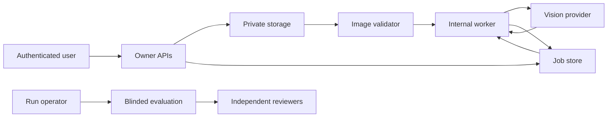

# IroGuide Live Review Pipeline Threat Model

## Executive summary

The highest risks are cross-account image/review access, unbounded image or provider-resource consumption, provider data leakage, worker replay, and activation-state bypass. The current repository has strong fail-closed capability, ownership, validation, idempotency, and deadline foundations, but no live provider may be enabled until real bucket, queue, provider-contract, reviewer, monitoring, and deletion-propagation evidence closes the residual boundaries.

## Scope and assumptions

In scope: `src/app/api/review-*`, `src/app/api/internal/review-*`, `src/server/review-*`, `src/domain/review*`, `src/server/provider-controls.ts`, evaluation tooling, Firebase rules, and provider-related environment configuration. Runtime provider/upload/job flows are distinguished from CI and offline evaluation. Community, billing, general marketing routes, and provider corporate infrastructure are out of scope except where they can change a capability.

Assumptions already established by the product owner: Vercel-hosted internet exposure, Firebase multi-tenant identities and owner-scoped data, sensitive private design images/briefs, free production profile, no authorized paid evaluation, and no live-provider activation. Scale, provider retention jurisdiction, queue implementation, named security/support owners, and approved non-production service credentials remain open; these unknowns keep provider activation `NO-GO`.

## System model

### Primary components

- Browser client and authenticated review UI (`src/features/review/review-studio.tsx`).
- Next.js owner APIs and internal worker APIs (`src/app/api/review-uploads`, `src/app/api/review-jobs`, `src/app/api/internal/review-*`).
- Firebase Auth, Firestore job/state records, and private Cloud Storage objects (`src/server/firebase-admin.ts`, `src/server/review-pipeline-storage.ts`).
- Image validation and provider boundary (`src/server/review-image-validator.ts`, `src/server/review-provider.ts`).
- Capability, quota, spend, and kill-switch controls (`src/domain/launch-capabilities.ts`, `src/server/provider-controls.ts`).
- Offline provider evaluation runner and human review packet (`scripts/provider-evaluation-runner.mjs`, `evals/reviews/reviewer-packet.md`).

### Data flows and trust boundaries

- Internet browser → owner API: ID token, brief, category, mode, upload identifiers over HTTPS; Firebase authentication, account locks, origin checks, Zod schemas, body limits, and rate limits are required.
- Owner API → Cloud Storage: exact user path, content type, nonce, expiry, and size policy; direct upload keeps image bytes off ordinary Application Functions (`src/server/review-pipeline-storage.ts`).
- Storage → validator worker: untrusted encoded image bytes; magic signature, decoder format, byte, dimension, page, and pixel limits are enforced (`validateReviewImage`).
- Internal dispatcher → worker APIs: job identifiers over HTTPS with a constant-time-checked worker bearer secret; pipeline mode and `aiCritique` capability must both be enabled (`getReviewPipelineStatus`, `isValidInternalWorkerRequest`).
- Worker → provider: bounded prompt plus image under a shared deadline; redirects are rejected and failures are classified (`src/server/review-provider.ts`).
- Worker → Firestore: validated review output and provenance; owner/idempotency/request-digest state controls retries (`src/server/review-job-contract.ts`, `src/server/review-pipeline-storage.ts`).
- Offline run operator → blinded reviewers: hashed, candidate-coded outputs without provider identity; ratings return through two reviewers plus adjudication (`scripts/lib/provider-evaluation-runner.mjs`).

#### Diagram

## Assets and security objectives

| Asset | Why it matters | Security objective (C/I/A) |
|---|---|---|
| Source images and briefs | May contain confidential client work or identifiers | C/I |
| Firebase identities and tokens | Authenticate tenant ownership and destructive actions | C/I/A |
| Upload sessions, nonces, paths, digests | Bind one object and request to one owner | C/I |
| Review jobs, results, and provenance | Must not be swapped, replayed, fabricated, or lost | I/A |
| Provider credentials and worker secrets | Can expose data and create spend | C/I/A |
| Capability, quota, spend, and kill-switch state | Prevents accidental/hostile activation and runaway cost | I/A |
| Evaluation corpus, blind sheets, ratings | Determines whether unsafe output is promoted | I/C |
| Deletion and audit records | Prove privacy actions and operational accountability | I/A |

## Attacker model

### Capabilities

A remote unauthenticated attacker can call public routes and send malformed bodies. A normal account can upload attacker-chosen supported image bytes, race requests, replay its own identifiers, observe its responses, and attempt cross-tenant identifiers. A compromised provider can return malformed, manipulative, or privacy-invasive output. An attacker who obtains a worker/provider secret can consume privileged compute within remaining network and quota controls.

### Non-capabilities

The attacker is not assumed to control Vercel environment administration, Firebase project administration, the signed source repository, two independent reviewers, or TLS endpoints. Risks requiring those privileges are configuration/supply-chain threats and are ranked separately.

## Entry points and attack surfaces

| Surface | How reached | Trust boundary | Notes | Evidence |
|---|---|---|---|---|
| Upload/session APIs | Authenticated HTTPS | Browser → Next.js | Owner, origin, schema, rate, capability | `src/app/api/review-uploads/route.ts` |
| Direct object upload | Signed HTTPS form | Browser → Storage | Exact path, nonce, type, size, expiry | `src/server/review-pipeline-storage.ts` |
| Image decoder | Internal worker | Storage → Sharp | Bytes/magic/dimensions/pixels/pages bounded | `src/server/review-image-validator.ts` |
| Job create/poll/cancel | Authenticated HTTPS | Browser → Next.js/Firestore | Idempotency and request digest | `src/server/review-job-contract.ts` |
| Dispatcher/validator/worker | Secret-authenticated HTTPS | Scheduler → internal APIs | Constant-time secret and capability | `src/server/review-pipeline-config.ts` |
| Provider request/response | Server HTTPS | Worker → provider | Deadline, redirect denial, strict output schema | `src/server/review-provider.ts` |
| Provider controls | Operator HTTPS | Operator → admin API | Kill switch, caps, ledger key | `src/server/provider-controls.ts` |
| Offline evaluation files | Local runner | Operator → reviewers | Candidate codes and output hashes | `scripts/lib/provider-evaluation-runner.mjs` |

## Top abuse paths

1. Cross-tenant read: account guesses another upload/job identifier → API/storage omits an owner comparison → private image or critique is disclosed.
2. Upload bomb: account obtains an upload policy → stores malformed/high-expansion content → validator exhausts memory/CPU or stalls queue capacity.
3. Replay/spend drain: account repeats finalize/job requests → idempotency is bypassed across retries → duplicate provider calls consume daily/monthly budget.
4. Worker-secret replay: secret leaks through logs/config → attacker invokes internal dispatch repeatedly → queued work and provider quota are exhausted.
5. Provider exfiltration: overly broad prompt/image/metadata crosses provider boundary → provider retains or logs confidential work beyond approved terms.
6. Output poisoning: provider invents evidence or returns instruction-like text → insufficient schema/provenance checks persist misleading critique as trusted.
7. Capability drift: credentials or a profile variable change → UI/API/worker gates disagree → paid work activates without evaluation or support approval.
8. Evaluation capture: run operator reveals candidate identities or alters holdout labels → biased scores produce an unsafe `GO` decision.

## Threat model table

| Threat ID | Threat source | Prerequisites | Threat action | Impact | Impacted assets | Existing controls (evidence) | Gaps | Recommended mitigations | Detection ideas | Likelihood | Impact severity | Priority |
|---|---|---|---|---|---|---|---|---|---|---|---|---|
| TM-001 | Authenticated tenant | Owner check or signed policy defect | Read/replace another tenant's object or job | Confidential design exposure and result corruption | Images, briefs, jobs | Owner-derived paths and job IDs; Firebase rules tests (`review-pipeline-storage.ts`, `firebase-security.rules.test.ts`) | No real approved-bucket proof | Pass cross-user, expired-token, deletion-lock, and exact-path tests against non-production Storage | Cross-owner denial counters; impossible-owner-path alerts | Medium | High | High |
| TM-002 | Authenticated tenant | Valid upload session | Submit decompression bomb, polyglot, animation, or oversized dimensions | Worker/queue denial of service | Compute, queue, availability | 4 MiB, magic, decoded-format, 8,192 dimension, 24 MP, single-page limits (`review-image-validator.ts`) | Decoder sandbox and concurrency cap not evidenced | Isolate decoding with memory/CPU deadline; cap per-account and global validator concurrency | Decode failure/type/pixel histograms and saturation alert | Medium | High | High |
| TM-003 | Authenticated tenant or retry storm | Weak idempotency/atomicity | Create duplicate provider jobs for one intent | Runaway spend and inconsistent reviews | Spend, jobs, results | Owner/input-bound IDs, request digest, atomic uniqueness (`review-job-contract.ts`) | Live queue duplicate-delivery drill absent | Prove concurrent finalize/dispatch/retry and ledger atomicity under failure injection | Duplicate digest, provider-call/job, cap-denial alerts | Medium | High | High |
| TM-004 | Secret thief | Worker key exposed | Invoke internal workers or drain queue | Provider spend, data processing, outage | Worker secret, provider quota | 32-byte minimum and timing-safe comparison; capability gate (`review-pipeline-config.ts`) | Rotation, audience binding, replay nonce not evidenced | Use short-lived workload identity or signed timestamp/nonce; rotate and audit | Repeated worker auth failures, unusual source, replayed job metrics | Low | High | High |
| TM-005 | Provider/operator misconfiguration | Live provider approved without binding terms | Retain or reuse images/prompts, or send excess metadata | Confidentiality/privacy breach | Images, briefs, credentials | Server-only provider boundary and redacted application logs | Terms, jurisdiction, retention/deletion propagation unapproved | Contractually prohibit training/retention; minimize payload; verify deletion and regional routing | Provider deletion audit and payload-field allowlist metrics | Medium | High | High |
| TM-006 | Compromised/misbehaving provider | Provider call succeeds | Return invented evidence, unsafe instructions, invalid priorities, or private content | Misleading user guidance and trust loss | Results, provenance, evaluation integrity | Strict schemas, evidence contract, blocking failures, human gate (`review-evaluation-foundation.md`) | 80/80 owned corpus; zero adjudicated cases | Complete blinded two-reviewer adjudication, thresholds, nondeterminism rejection | Unsupported finding, invalid output, user feedback, drift alerts | High | High | High |
| TM-007 | Misconfiguration or privileged insider | Environment/config access | Enable profile/provider/Storage without gate approval | Unreviewed paid capability reaches users | Capabilities, spend, images | Production defaults free; pipeline also requires mode, capability, secret; provider kill switch defaults on (`launch-capabilities.ts`, `provider-controls.ts`) | Independent deployment approval/capability-drift monitor incomplete | Protected envs, SHA-bound promotion, four-eyes approval, scheduled capability probes | Alert on flag/secret/deployment changes and any free-mode provider call | Low | High | High |
| TM-008 | Evaluation operator/reviewer | Candidate identity or holdout access | Bias ratings, modify expected labels, omit failures | False provider promotion | Corpus, ratings, decision | Deterministic candidate codes/output hashes and two reviewers plus adjudicator | Named reviewers, locked records, independent audit absent | Separate roles; append-only signed ratings; disclose conflicts; freeze hashes before run | Hash mismatch, late edits, disagreement and unblinding audit | Medium | Medium | Medium |
| TM-009 | Remote attacker | Public API access | Flood auth/origin/body failures or polling | Partial availability loss | API, rate-limit store | Body budgets, same-origin checks, account/IP rates, no-store errors | Load and regional failover evidence incomplete | Global burst caps, queue backpressure, synthetic probes, error-budget response | Rate-limit mode, 429, latency, queue-age alerts | Medium | Medium | Medium |
| TM-010 | User or operator | Deletion/cancel/revoke races with work | Provider continues or result/object survives deletion | Privacy promise violation | Images, jobs, results, audit | Application deletion locks and cancel/revoke states | Provider deletion propagation and queue-drain drill absent | Tombstone before work; worker checks lock pre/post call; deletion retry ledger and SLA | Orphan scan, post-lock provider-call alert, deletion-age SLO | Medium | High | High |

## Criticality calibration

- Critical: unauthenticated bulk cross-tenant image export, remote execution in image decoding, or a release-control bypass that broadly exposes private content.
- High: single/cross-tenant design exposure, repeatable provider spend drain, provider retention breach, invented-evidence promotion, or deletion-lock bypass.
- Medium: bounded authenticated denial of service, evaluation-integrity weakness requiring an insider, or telemetry poisoning that delays detection.
- Low: non-sensitive version disclosure, noisy rejected malformed requests, or a defect needing both project administration and provider administration with no user impact.

## Focus paths for security review

| Path | Why it matters | Related Threat IDs |
|---|---|---|
| `src/server/review-pipeline-storage.ts` | Owner paths, upload policies, state transitions, and job writes converge here | TM-001, TM-003, TM-010 |
| `src/server/review-image-validator.ts` | Parses attacker-controlled image bytes | TM-002 |
| `src/server/review-provider.ts` | External data, response, timeout, redirect, and schema boundary | TM-005, TM-006 |
| `src/server/provider-controls.ts` | Kill switch, quotas, caps, and spend ledger | TM-003, TM-007 |
| `src/server/review-pipeline-config.ts` | Internal worker authentication and double-gating | TM-004, TM-007 |
| `src/app/api/review-uploads/` | Internet-facing upload lifecycle | TM-001, TM-002, TM-009 |
| `src/app/api/review-jobs/` | Internet-facing job create/poll/cancel lifecycle | TM-003, TM-009, TM-010 |
| `src/app/api/internal/review-pipeline/` | Privileged dispatch/reconcile entry points | TM-003, TM-004 |
| `firebase.rules` and `storage.rules` | Direct client tenant boundary | TM-001, TM-010 |
| `scripts/lib/provider-evaluation-runner.mjs` | Blind assignment, hashing, cost and latency evidence | TM-006, TM-008 |
| `evals/reviews/manifest.json` | Owned-corpus integrity and distribution | TM-006, TM-008 |
| `.github/workflows/` | Release and supply-chain authorization | TM-007 |

## Quality check

- Runtime entry points, Storage, decoder, worker, provider, persistence, operator controls, and offline evaluation are covered.
- Every identified trust boundary appears in at least one threat.
- Runtime, CI/release, and offline evaluation controls are separated.
- Owner-confirmed free/no-paid/no-Community/no-billing context is reflected; scale, provider terms, queue, and named-owner unknowns are explicit.
- No credential, token, private image, prompt, customer content, or signed URL is included.
