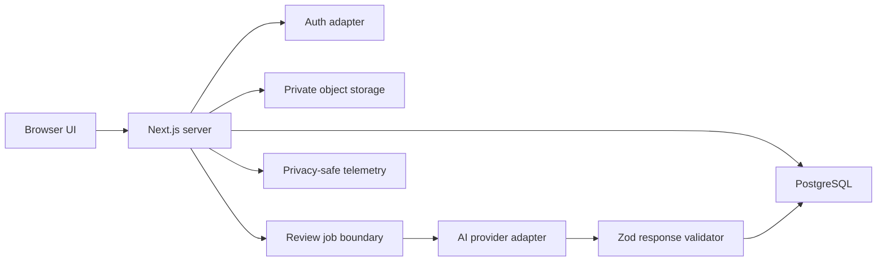

# IroGuide Technical Architecture

Status: Approved implementation baseline  
Phase: 4 — Technical architecture planning

## Stack decision

- **Application:** Next.js 16 App Router, React 19, TypeScript 6 in strict mode.
- **Styling:** Tailwind CSS 4 plus CSS custom-property design tokens.
- **Validation:** Zod 4 at every untrusted boundary.
- **Persistence:** PostgreSQL with Drizzle ORM and SQL migrations.
- **Authentication:** standards-based session provider behind a local `AuthService` interface.
- **Storage:** private S3-compatible object storage behind a `DesignStorage` interface.
- **AI:** server-only, vision-capable provider behind an `AiReviewProvider` interface.
- **Testing:** Vitest and Testing Library for unit/component behavior; Playwright for critical flows.
- **Observability:** structured server logs, request correlation IDs, error reporting adapter, and privacy-safe product events.

Dependencies are pinned by the lockfile. Provider SDKs must not be imported from UI or domain modules.

## System boundaries



For the first deploy, the job boundary may execute synchronously with a hard timeout, but it retains an explicit interface so a durable queue can replace it without changing the review UI or domain service.

## Repository and module layout

```text
frontend/
  src/app/             Next.js routes, metadata, and layouts
  src/features/        review, marketing, dashboard, and portfolio UI
  src/domain/          browser-safe schemas and view-model logic
backend/
  src/domain/          review schemas, rubrics, and quality rules
  src/services/        AI/provider-facing application services
  src/app.ts           HTTP composition and API routes
  src/server.ts        standalone Fastify process
```

The frontend communicates with the backend over HTTP and contains no server API
routes. Backend domain code does not depend on Fastify, Next.js, storage, or a
provider SDK. Each application owns its dependency lockfile and quality pipeline.

## Core data model

### users

- `id` UUID primary key
- `email` case-normalized unique value
- `display_name`, `avatar_url`, `plan`
- `created_at`, `updated_at`, `deleted_at`

### design_uploads

- `id`, `user_id`
- `storage_key` (never a permanent public URL)
- `original_name`, `mime_type`, `byte_size`, `width`, `height`
- `sha256`, `category`, `status`
- `created_at`, `deleted_at`

### design_briefs

- `id`, `upload_id`
- required: `target_audience`, `purpose`, `style`, `goal`
- optional: `industry`, `brand_tone`, `platform`, `specific_concern`, `inspiration`
- `created_at`, `updated_at`

### reviews

- `id`, `user_id`, `upload_id`, `brief_id`
- `mode`, `status`, `schema_version`, `rubric_version`, `provider_trace_id`
- `overall_score`, `summary`, `strengths` JSONB, `category_scores` JSONB
- `checklist` JSONB, `uncertainty`, `created_at`, `completed_at`, `deleted_at`

### review_issues

- `id`, `review_id`, `category`, `score`, `priority`, `position`
- `observation`, `impact`, `recommendation`, `specific_actions` JSONB

### follow_up_messages

- `id`, `review_id`, `user_id`, `role`, `content`
- `provider_trace_id`, `created_at`

### improved_versions

- `id`, `review_id`, `kind`, `storage_key`, `prompt`, `change_summary` JSONB
- `created_at`, `deleted_at`

Ownership checks are mandatory on every user-scoped query. Soft deletion supports recovery while a scheduled retention process removes database and storage objects permanently.

## HTTP contract

All endpoints use authenticated server sessions, JSON problem details for errors, request IDs, bounded bodies, and rate limits.

| Method | Route | Purpose |
| --- | --- | --- |
| `POST` | `/api/uploads/presign` | Validate metadata and issue short-lived private upload instructions |
| `POST` | `/api/uploads/complete` | Verify object metadata and persist an upload |
| `GET` | `/api/uploads/:id` | Return owned upload metadata and short-lived preview URL |
| `DELETE` | `/api/uploads/:id` | Delete an owned upload and dependent data |
| `POST` | `/api/reviews` | Validate brief/mode and begin review generation |
| `GET` | `/api/reviews/:id` | Return an owned structured review |
| `GET` | `/api/reviews` | Cursor-paginated owned review history |
| `DELETE` | `/api/reviews/:id` | Delete an owned review |
| `POST` | `/api/reviews/:id/follow-ups` | Ask a bounded contextual question |
| `POST` | `/api/reviews/:id/improvement-plan` | Generate a user-requested plan or prompt |
| `GET` | `/api/dashboard` | Return owned aggregates and recommendations |

Mutation routes accept an idempotency key. List routes use opaque cursor pagination. Route handlers call domain use cases rather than issuing database/provider operations directly.

## Review output schema

```ts
type ReviewOutput = {
  schemaVersion: "1";
  overallScore: number; // 0..10, one decimal maximum
  summary: string;
  strengths: Array<{ title: string; evidence: string }>;
  categoryScores: Record<ReviewCategory, {
    score: number;
    rationale: string;
  }>;
  issues: Array<{
    category: ReviewCategory;
    score: number;
    priority: "high" | "medium" | "low";
    observation: string;
    impact: string;
    recommendation: string;
    specificActions: string[];
  }>;
  finalChecklist: Array<{
    label: string;
    priority: "high" | "medium" | "low";
    issueIndex: number;
  }>;
  followUpSuggestions: string[];
  uncertainty?: string;
};
```

The server parses provider output with Zod, checks score/rationale alignment, requires complete what/why/how issue fields, verifies checklist references, and retries one repair pass before returning a safe failure.

## AI prompt layers

1. **System contract:** experienced design mentor role, safety, evidence grounding, output schema.
2. **Mode policy:** language, depth, and directness; never changes rubric or factual standard.
3. **Category rubric:** applicable principles, scoring anchors, category-specific checks.
4. **User brief:** normalized user context wrapped as untrusted content.
5. **Image input:** short-lived signed reference or provider-supported bytes.
6. **Consistency pass:** contradictions, unsupported claims, checklist alignment, uncertainty.

Prompts are versioned in source. User text cannot override system instructions or request secrets. Provider responses are not rendered as HTML.

## Security and privacy

- Validate extension, declared MIME, detected signature, decoded dimensions, and file size.
- Allow JPEG, PNG, and WebP only in MVP; reject SVG/PDF until isolated processing exists.
- Use random storage keys, private buckets, short-lived signed URLs, and encryption in transit/at rest.
- Strip unnecessary image metadata where supported.
- Apply CSRF protection to session mutations, secure cookies, origin checks, CSP, and security headers.
- Rate-limit uploads, generation, follow-ups, and auth attempts by user and privacy-safe network key.
- Never log images, signed URLs, briefs, model prompts, or full model responses in production logs.
- Do not train, publish, or share from user uploads without separate explicit consent.
- Make upload, review, export, and account deletion discoverable.
- Keep secrets server-side and validate required environment variables at startup.

## Reliability and efficiency

- Bound upload size at 10 MB and image dimensions at a configurable maximum.
- Hash uploads for integrity and optional per-user duplicate detection.
- Use abortable provider requests with deadlines, retry only safe transient failures, and prevent duplicate review jobs.
- Cache immutable signed-neutral metadata, not private image URLs or personalized reviews at shared edges.
- Stream or poll honest review states; never fabricate progress.
- Use database indexes on `(user_id, created_at)`, status, and foreign keys.
- Record schema, rubric, and prompt versions on each review for reproducibility.

## Environment contract

```text
DATABASE_URL=
AUTH_SECRET=
APP_URL=
OBJECT_STORAGE_ENDPOINT=
OBJECT_STORAGE_REGION=
OBJECT_STORAGE_BUCKET=
OBJECT_STORAGE_ACCESS_KEY_ID=
OBJECT_STORAGE_SECRET_ACCESS_KEY=
AI_PROVIDER=
AI_API_KEY=
AI_VISION_MODEL=
AI_TEXT_MODEL=
```

Local development may use an explicit deterministic demo provider. Production must fail closed if configured with demo AI, in-memory auth, or public storage.

## Deployment gates

- Formatting, lint, strict typecheck, unit tests, and production build pass.
- Database migrations are reviewed and forward-compatible.
- Critical upload-to-review and deletion paths pass browser tests.
- Accessibility scan has no serious or critical findings on primary routes.
- Security headers, rate limits, secret validation, and private storage are verified in staging.
- Provider timeouts and invalid-response recovery are exercised before release.
