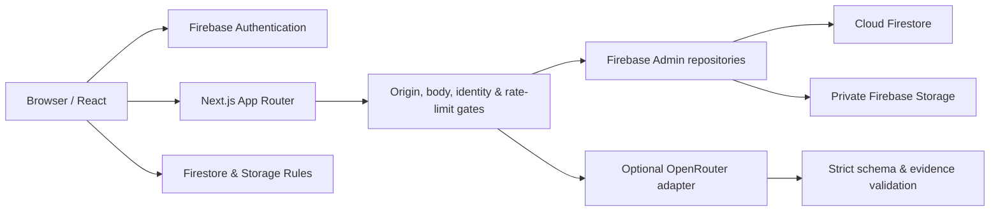

# IroGuide Technical Architecture

Status: Current implementation baseline
Last verified: 2026-08-24

## Runtime and stack

IroGuide is one integrated Next.js 16 application, not a separate frontend/backend pair.

- Next.js App Router and React 19 render public and authenticated UI.
- Route handlers under `src/app/api/**/route.ts` are the server API.
- TypeScript and Zod define browser-safe domain contracts.
- Firebase Authentication supplies identity; server routes verify Firebase ID tokens.
- Firebase Admin accesses Firestore and private Storage from server-only modules.
- OpenRouter is an optional server-only provider. It is inactive in production `free`.
- Vitest, Firebase emulators, Playwright, and production smoke form the test layers.


```mermaid
flowchart LR
  Browser["Browser / React"] --> Auth["Firebase Authentication"]
  Browser --> Routes["Next.js App Router"]
  Browser --> Rules["Firestore & Storage Rules"]
  Routes --> Security["Origin, body, identity & rate-limit gates"]
  Security --> Admin["Firebase Admin repositories"]
  Security --> Provider["Optional OpenRouter adapter"]
  Provider --> Evidence["Strict schema & evidence validation"]
  Admin --> Firestore["Cloud Firestore"]
  Admin --> Storage["Private Firebase Storage"]
```

## Module boundaries

```text
src/app/                 routes, layouts, route handlers, global styles
src/features/<area>/     product UI and feature-local orchestration
src/components/          reusable primitives and motion utilities
src/domain/              pure schemas, capability rules, rubrics, progress logic
src/lib/                 browser integrations, persistence adapters, hooks
src/server/              auth, policy, rate limits, Firebase Admin, providers
public/                  static public assets
e2e/                     Playwright user journeys
```

Client modules never import `src/server/`. Route handlers authenticate and authorize before calling repositories or providers. Firebase client reads remain protected by rules; trusted review writes are server-only.

## Launch capabilities

`IROGUIDE_LAUNCH_PROFILE` resolves on the server and is passed to the client provider. Invalid production values fail closed to `free`.

| Capability | development | free production | full production |
| --- | --- | --- | --- |
| AI critique | deterministic local provider | denied | eligible only with provider readiness and entitlement |
| Source-image storage | off by default | denied for new images | eligible with private Storage readiness |
| Bug-report email | off | stored, delivery disabled | eligible with verified Resend configuration |
| Community | gated | gated | gated until separate safety approval |

Credentials do not enable a capability. Route-level behavior is in `docs/capability-route-matrix.md`.

## Current data model

### `reviews`

Server-written trusted review documents containing UID ownership, normalized output, category, provider, timestamps, sync state, optional source-image metadata, and server provenance.

### `reviewDrafts`

The browser may write only `<uid>_active`. Server sync may retain imported, untrusted review copies here. Imported copies cannot claim server provenance, enter progress evidence, or become public.

### `reviewFeedback`

Server-written, owner-authorized verdicts for individual findings.

### `bugReports`

Server-written reports. Free mode stores reports and records email delivery as intentionally disabled.

### Community collections

`communityPosts` and nested comments/interactions exist as inactive implementation material. Firestore reads and client writes are denied while gated.

## Request and trust boundaries

Every mutation applies the relevant sequence before business work:

1. Same-origin and content-type checks.
2. Trusted client identity and distributed rate limit.
3. Firebase token verification and, for destructive actions, recent-login verification.
4. Server capability and entitlement policy.
5. Actual-stream byte budget before JSON or multipart parsing.
6. Zod/domain validation.
7. UID-scoped repository/provider work.
8. No-store response headers and privacy-safe structured logs.

Vercel uses its protected forwarded-for header. Non-Vercel production must explicitly declare a trusted proxy adapter; otherwise readiness and security rate limits fail closed.

## Review and progress integrity

Trusted reviews require server provenance and agreement between stored and nested provider fields. Provider output must contain evidence facts; normalization may assign internal IDs but may not invent scores, findings, evidence, or actions.

Account history orders by server `savedAt` descending and document ID descending. Progress uses only server-verified reviews in the newest review's category, rubric, provider, and score-dimension cohort. Local/imported or incompatible reviews remain readable but do not alter learning claims.

## Images

The active proxied multipart limit is 4 MB, below the hosting Function ceiling after overhead. New source-image persistence remains off in free production. The future direct-upload state machine and validation contract are in `docs/architecture/0001-direct-private-review-uploads.md`.

## Provider boundary

OpenRouter calls have one 25-second deadline shared by primary and fallback. Only network failures, 408, 429, and 5xx responses may use fallback. Permanent failures and invalid evidence do not retry. Generic endpoint mode is disabled in production; development endpoints require an exact hostname allowlist with redirects disabled.

A durable `(uid, idempotencyKey)` job is required before live paid activation. Its accepted contract is in `docs/architecture/0002-provider-and-network-boundaries.md`; free production never reaches the billed path.

## Deletion

Review, draft, feedback, and historical image cleanup is idempotent and bounded. Storage cleanup runs regardless of the current creation capability. Partial deletion returns a privacy-safe failure list and retry token; identity deletion occurs only after required cleanup succeeds.

## Reliability and progressive rendering

- Route-level server rendering provides the initial public shell.
- Client-only Firebase and interactive features are explicit.
- Private collections use limits and deterministic ordering.
- Long lists and future history expansion use cursor pagination.
- Loading, empty, unavailable, and error states reveal only the next useful action.
- Shared-edge caches never store private data, signed URLs, or capability decisions.
- Provider, body, rate-limit, readiness, and deletion failures are observable without logging private content.

## Configuration and promotion

Use `.env.example` as the contract. Production requires Firebase Admin and matching public/Admin project IDs. Vercel satisfies client identity automatically; other hosts declare a sanitized proxy header. `IROGUIDE_LAUNCH_PROFILE=free` remains the production decision.

`npm run check` verifies pinned Actions, types, lint, unit tests, Firebase rules, and production build. `npm run test:e2e:free` proves the free-profile UI and Community route. Deployment smoke verifies routes, readiness, auth denial, Community denial, headers, and—when approved—authenticated and rules operations. Reports are retained as workflow artifacts.
