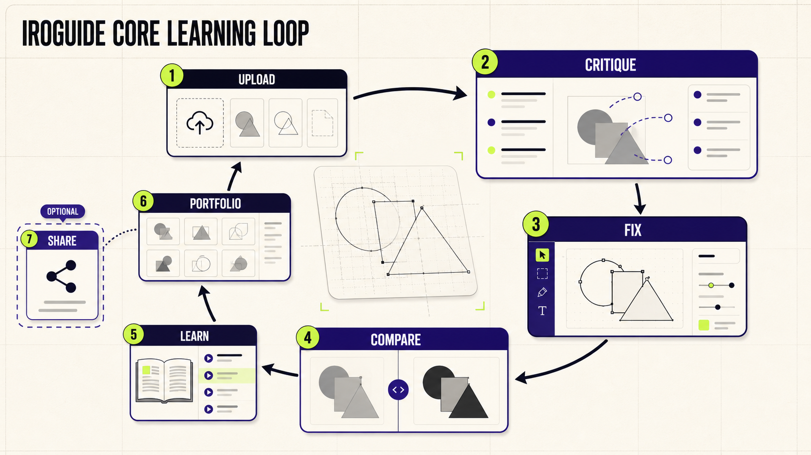
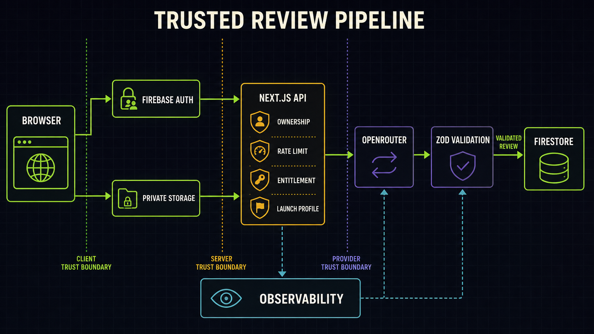
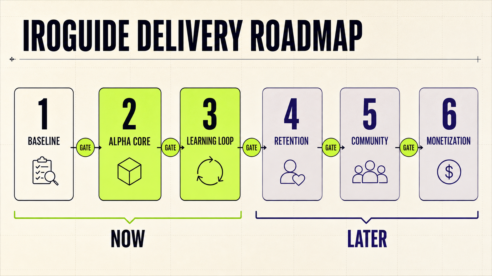

# IroGuide Implementation Plan

**Status:** Revised post-audit implementation baseline  
**Scope:** Mandatory risk remediation, free-profile product readiness, core learning-loop preparation, retention sequencing, and gated future expansion  
**Repository:** IroGuide Next.js application  
**Visual baseline:** Core Learning Loop, Trusted Review Pipeline, and Delivery Roadmap  
**Audit baseline:** Codex Security scan `8ff24665-6c81-4937-ab35-ed1a3400ca32` — 3 Medium and 2 Low validated findings; no Critical or High security finding

## 1. Document Purpose

This plan converts the confirmed product direction and the completed architecture/security audit into an executable sequence for IroGuide. It keeps production on the `free` launch profile, gates Community, repairs known trust-boundary and data-integrity defects before feature work, prepares the high-value learning loop without activating paid AI services, and separates immediate work from later retention, community, and monetization work.

The immediate release objective is not a public live-AI critique launch. In the current implementation, the `free` profile disables new AI critique, source-image cloud storage, and bug-report email. The immediate outcome is therefore a trustworthy free-profile preview and readiness baseline that can be safely operated while the live-provider activation decision remains deferred.

This document is a plan, not a claim that the conceptual features shown in the visuals are already implemented. Audit remediation is a prerequisite, not optional hardening: no external release or later capability activation may bypass Phase 0.

## 2. Project Foundation

### Core Vision

IroGuide is a professional design-critique and learning platform. It should explain what is working or failing, why it matters for the design's audience and purpose, and how the designer can improve the work.

The product is not primarily an image generator, social network, portfolio host, or marketplace. Its differentiating loop is:

`Upload → Critique → Fix → Compare → Learn → Portfolio → Optional sharing`

### Problem Being Solved

Design feedback is frequently vague, delayed, subjective, or inaccessible. IroGuide turns feedback into an evidence-grounded, prioritized, actionable learning process while preserving privacy and user control.

### Target Users

The first primary cohort contains three related groups:

1. **Beginner designers** — need clear language, principle-based teaching, and an obvious first correction.
2. **Freelancers** — need fast quality control, delivery confidence, and credible before/after evidence.
3. **UI/UX designers** — need task clarity, hierarchy, accessibility, consistency, and interaction-specific critique.

The onboarding experience should be beginner-safe. The depth and evidence contract should remain useful to freelancers and UI/UX professionals.

### Current Project Stage

The repository is a mature local and testable product implementation with:

- a responsive marketing site;
- Firebase authentication and protected account surfaces;
- a four-step review workflow with drafts and validation;
- deterministic preview critique and a gated live-provider path;
- structured review results, annotations, prioritized issues, and checklists;
- trusted review provenance and account synchronization;
- dashboard, progress, portfolio, community, pricing, and operational surfaces;
- launch-profile enforcement, ownership checks, rate limits, readiness diagnostics, and security smoke tooling.

The deployed external-service configuration and operational readiness remain environment-dependent.

### Existing Components

- `src/features/review/` — review studio, results, follow-ups, improvement plan, comparison.
- `src/features/dashboard/` — saved reviews, drafts, review details, progress.
- `src/features/auth/` — Firebase account entry, session state, profile, account controls.
- `src/features/community/` — publishing, feed, comments, reactions, saved posts.
- `src/features/portfolio/` — case-study workshop derived from reviews.
- `src/server/` — Firebase Admin, provider integration, authorization, rate limits, storage, observability, readiness.
- `src/domain/` — Zod schemas, rubrics, review contracts, plan rules, progress logic.
- `src/app/api/` — integrated Next.js API handlers.

### Post-Audit Baseline

The repository passes its current mechanical quality gate—workflow-pin verification, typecheck, lint, 186 unit tests, 12 Firebase rules tests, and production build—but the audit identified behavior that the existing suite does not adequately model.

| Ref | Validated flaw or gap | Classification | Plan disposition |
| --- | --- | --- | --- |
| AUD-001 | Predictable review-draft IDs can be pre-created by another authenticated user | Medium security, CWE-639 | Mandatory Phase 0 fix |
| AUD-002 | JSON and multipart bodies are buffered before application size validation | Medium security, CWE-400 | Mandatory Phase 0 boundary fix |
| AUD-003 | Non-Vercel production collapses public/pre-auth rate limits onto `unknown` | Medium security, CWE-400 | Mandatory Phase 0 platform contract |
| AUD-004 | Free profile skips deletion of images created under a previous storage-enabled profile | Low security/privacy, CWE-459 | Mandatory Phase 0 lifecycle fix |
| AUD-005 | Custom provider validates only the initial hostname, not resolved IPs or redirect hops | Low security, CWE-918 | Required before custom-provider activation |
| AUD-006 | Community is operational without a first-class capability, report/block/moderation, or per-item deletion | Product/safety release blocker | Gate immediately; safety work remains later |
| AUD-007 | Progress combines incompatible or unverified reviews and queries an unordered subset | Product data-integrity blocker | Correct before displaying progress claims |
| AUD-008 | The 10 MB application upload contract exceeds Vercel's 4.5 MB Function payload ceiling | Deployment/UX blocker | Replace future upload architecture |
| AUD-009 | Provider calls have no deadline; retries are not transient-only; normalization can manufacture missing critique fields | Reliability/trust blocker for live mode | Required before provider activation |
| AUD-010 | Account deletion, Community counters, and large client orchestrators do not scale safely | Scalability/maintainability | Sequence after immediate blockers, before activation at scale |

The canonical security report is stored outside the repository in the completed scan workspace. This plan carries the remediation requirements so implementation does not depend on that temporary artifact remaining available.

### Locked Decisions

- Primary cohorts: beginner designers, freelancers, and UI/UX designers.
- Community remains gated for now.
- Production remains on `IROGUIDE_LAUNCH_PROFILE=free`.
- The existing Next.js 16, React 19, TypeScript, Firebase, Zod, and OpenRouter-compatible architecture remains the baseline.
- Private-by-default review handling, ownership scoping, same-origin checks, validation, and rate limits must not be weakened.
- The three generated planning visuals form one complementary direction.

### Stable Decisions

- A review must remain evidence-based, actionable, respectful, and grounded in the user's brief.
- Feedback modes change tone and explanation depth, not factual standards or rubric quality.
- Demo output must be clearly identified and must never be presented as live pixel analysis.
- Public sharing requires separate consent and safety controls.
- Payments and team workspaces remain outside the immediate release.

### Confirmed Constraints

- No paid live-provider activation in production during the immediate phase.
- No production source-image cloud operations while the free profile disables that capability.
- No Community activation merely because implementation code already exists.
- No fabricated progress, performance, customer, pricing, or outcome claims.
- No dates or team assignments are assumed in this plan.

### Success Criteria

- Free-profile behavior is consistent across navigation, UI controls, APIs, tests, and production smoke.
- Users never mistake disabled or deterministic functionality for live AI analysis.
- Community cannot be used publicly until its later release gate is explicitly approved.
- Existing authenticated history, drafts, account controls, and readable trusted review data continue to work.
- The codebase is ready for a future provider activation without requiring a product or security rewrite.
- Draft paths are cryptographically/structurally owner-bound and cannot be squatted by another account.
- Deletion removes historical private data regardless of the current launch profile and reports retryable partial failure.
- Request cost is bounded before parsing, and the upload contract matches the deployment platform.
- Progress claims use an ordered, provenance-compatible, rubric-compatible cohort.
- Quality gates remain green and primary flows remain accessible from mobile, keyboard, and reduced-motion contexts.

## 3. Final Requirements

### Functional Requirements

- **FR-001:** The application must expose a single authoritative launch-capability state to server and client surfaces.
- **FR-002:** Under the `free` profile, every new-critique entry point must explain that new AI critique is unavailable and must not call the generation API.
- **FR-003:** The review generation API must continue to reject free-profile generation server-side even if a client bypasses the UI.
- **FR-004:** Authentication, account settings, trusted review text history, drafts, and permitted Firestore operations must remain available under the free profile.
- **FR-005:** Source-image cloud upload, synchronization, and retrieval must remain disabled when the launch profile disables source-image storage.
- **FR-006:** Deterministic critique, follow-up, improvement, and comparison output must be labeled as preview or derived behavior and not as live analysis.
- **FR-007:** Community must be controlled by an explicit capability gate rather than navigation visibility alone.
- **FR-008:** Community publishing, commenting, and persisted interactions must be unavailable to general production users while Community is gated.
- **FR-009:** Direct Community URLs must return a clear unavailable state or an access-controlled internal preview; they must not silently expose an active public product.
- **FR-010:** Pricing must remain a non-transactional hypothesis surface with checkout disabled.
- **FR-011:** The dashboard must derive insights only from reviews whose trust state is suitable for the displayed claim.
- **FR-012:** The product must preserve rubric, provider, and provenance information required to distinguish demo, imported, and trusted live reviews.
- **FR-013:** The future comparison capability must map previous issues into `improved`, `remaining`, and `regressed` outcomes.
- **FR-014:** The future follow-up capability must remain scoped to one owned review and a bounded conversation.
- **FR-015:** Improvement planning must either be a deterministic derivation from a trusted review or a separately gated provider operation; its UI label must match the actual behavior.
- **FR-016:** Portfolio preparation must remain private until export or publication is separately approved.
- **FR-017:** Readiness diagnostics must show configured capability, active capability, and missing prerequisite as distinct states.
- **FR-018:** Product analytics must remain consent-aware and exclude uploaded designs, review content, prompts, authentication secrets, and personal identifiers.
- **FR-019:** The bug-report path must continue storing reports safely even when email delivery is disabled.
- **FR-020:** Every gated capability must have test coverage proving both UI suppression and server-side denial.
- **FR-021:** Review-draft document paths must be derived from and bound to the authenticated UID; one user must be unable to reserve another user's active-draft path.
- **FR-022:** Review history queries must use an explicit newest-first order and cursor pagination; a limit must never be applied before the ordering that supports a recency claim.
- **FR-023:** Progress calculations must exclude or separately present legacy-unverified, category-incompatible, rubric-incompatible, or provider-incompatible evidence.
- **FR-024:** Account and review deletion must attempt historical source-image cleanup independently of the current launch profile.
- **FR-025:** Deletion must return a complete result for reviews, drafts, feedback, source images, Community derivatives, failures, and retry state.
- **FR-026:** Every request route must enforce a documented byte budget before whole-body JSON or multipart parsing.
- **FR-027:** Future source-image upload must use a deployment-compatible direct-to-private-storage flow; image bytes larger than the Function ceiling must not transit a Next.js Function.
- **FR-028:** Provider calls must have abortable deadlines, transient-only bounded retry, idempotency, and explicit failure classes.
- **FR-029:** Missing or malformed provider evidence must fail closed; normalization may sanitize representation but must not invent observations, evidence, scores, or confidence.
- **FR-030:** A custom provider endpoint must be allowlisted or validated after DNS resolution and at every redirect hop, including private/reserved IPv4 and IPv6 rejection.
- **FR-031:** Non-Vercel production must declare a trusted client-identity adapter or fail readiness; it must not place every caller in one global rate-limit bucket.
- **FR-032:** Community must support per-item author deletion, reporting, blocking, moderator action, audit history, and deletion propagation before activation.
- **FR-033:** Production deployment must have an automated post-deploy smoke path; manually dispatched DAST remains an additional release approval, not the only control.

### Non-Functional Requirements

- TypeScript strict-mode checks, ESLint with zero warnings, unit tests, rules tests, Playwright, and production build must pass before release.
- The application must remain usable from 320 px through wide desktop without horizontal page overflow.
- Keyboard navigation, visible focus, semantic landmarks, screen-reader labels, reduced-motion behavior, and WCAG AA contrast must be preserved.
- API bodies, image metadata, provider responses, and stored documents must be schema validated.
- Request byte limits must be enforced before schema parsing; schema validation is not a substitute for transport bounds.
- Security-sensitive logs must be structured and exclude private content.
- Free-profile denials must be fail-closed and consistent across server instances.
- Deletion and migration jobs must be cursor-based, idempotent, resumable, and observable once account volume can exceed one request's safe execution budget.
- User-visible metrics must declare their evidence cohort and must not average semantically incompatible dimensions.
- The immediate work should avoid new production dependencies unless an existing capability cannot satisfy the requirement.

### User Experience Requirements

- Beginner designers receive plain-language explanations and one obvious first action.
- Freelancers can understand whether the product currently supports real delivery-quality analysis before uploading work.
- UI/UX designers see rubric language relevant to task clarity, hierarchy, affordance, consistency, accessibility, and responsive behavior.
- Disabled capabilities explain why they are unavailable and what remains usable.
- No dead-end CTA should lead users into an operation the active launch profile will reject.
- Drafts and entered context must survive recoverable failures.

### Technical Requirements

- Keep server-only provider credentials, Firebase Admin access, authorization, rate limiting, and storage operations under `src/server/`.
- Keep Zod schemas and pure rules in `src/domain/`.
- Keep client capability presentation derived from server-owned configuration rather than public credentials.
- Preserve request correlation, no-store API responses, same-origin enforcement, ownership scoping, and verified-email/entitlement checks.
- Bind mutable Firebase document namespaces to UID-derived paths and enforce the same invariant in emulator tests.
- Separate feature-enable capabilities from lifecycle cleanup capabilities; disabling creation must never disable destruction.
- Treat Vercel's request ceiling, trusted proxy headers, Function duration, and post-deploy behavior as explicit platform contracts.
- Version future comparison, follow-up, and improvement contracts before activating them.

### Business Requirements

- The free profile must not create unapproved provider cost.
- Pricing must remain a hypothesis until usage, value, support load, and cost are observed.
- The product message must align with what external users can actually do in the current profile.
- Community must not become an acquisition dependency before retention and moderation are proven.

### Security and Privacy Requirements

- Private-by-default is mandatory.
- No cross-account review, draft, image, or conversation access is permitted.
- Public data must be intentionally selected and separately shaped from private review documents.
- Community activation requires consent withdrawal, reporting, blocking, moderation, deletion propagation, and abuse controls.
- Account deletion must cover authenticated data and any later public derivatives.
- Account deletion must remain complete across `full → free`, provider, and storage configuration transitions.
- Provider-supplied critique is untrusted until strict schema, rubric, evidence, and provenance validation succeeds.

## 4. Assumptions and Unknowns

### Confirmed Information

- The primary cohorts are beginner designers, freelancers, and UI/UX designers.
- Community is gated.
- Production stays on the free profile.
- The current repository is the implementation baseline.

### Assumptions Used

- **A-001:** The generated visual direction is accepted because the user supplied the requested product decisions after visual review. This is reversible before implementation begins.
- **A-002:** The immediate external experience is a free-profile preview/readiness release rather than a live critique alpha.
- **A-003:** Existing Community code is preserved behind a gate rather than deleted.
- **A-004:** Provider-compatible code and tests may continue to be developed locally without enabling paid production calls.
- **A-005:** Beginner-safe onboarding is the common entry experience, while freelancer and UI/UX value is delivered through rubric depth and later comparison outcomes.

### Items Requiring Future Validation

- The budget and approval threshold for activating live provider calls.
- The exact external release audience and distribution channel for the free-profile preview.
- Whether a deterministic local critique demo is exposed only in development or through a clearly isolated public sample experience.
- Retention and usefulness thresholds that justify Community or billing activation.
- Legal review requirements before broader public use or payments.

None of these items blocks the immediate free-profile readiness work. They block later capability activation.

### Resolved Post-Audit Design Decisions

| Decision | Rationale | Alternatives considered |
| --- | --- | --- |
| Gate Community with one server-owned capability applied at UI, route, API, and Firebase boundaries | Navigation-only gating leaves direct URLs and SDK reads active | Hide links only; delete Community code; leave read-only feed active |
| Bind drafts under a UID-derived namespace and enforce bounded cardinality | Document-body ownership does not prevent predictable path squatting | Random global IDs; retain `{uid}_active` with no path rule; server-only drafts |
| Keep deletion callable across launch profiles and persist retry state | Privacy duties survive configuration transitions and transient infrastructure failure | Skip Storage in free mode; delete identity first; best-effort logging only |
| Use pre-parse transport budgets plus direct private image uploads | Zod/file checks occur too late to protect memory, and Vercel Functions cannot carry the documented 10 MB body | Lower all images below 4.5 MB; base64 JSON; self-host only |
| Make progress cohort-based and newest-first | A score trend is meaningful only across compatible evidence selected deterministically | Average all reviews; label imports but still include them; show one global score |
| Fail closed on incomplete provider critique | Invented fallback evidence undermines the core trust promise | Continue generic defaults; store partial live reviews; retry every failure |
| Require host-specific trusted client identity | Generic forwarded headers are spoofable, while `unknown` creates global lockout | Trust `x-forwarded-for` everywhere; remove pre-auth limits; support Vercel only without declaring it |
| Introduce idempotent review/deletion job semantics before live activation or scale | Client retries and Function interruption must not duplicate cost or lose cleanup work | Synchronous requests indefinitely; add a queue only after incidents |

### Contract Changes Required by the Audit

- **Capability contract:** add `community`; expose configured, approved, active, and unavailable-reason states without leaking secrets.
- **Draft contract:** UID-bound path, one active draft per user, bounded imported drafts, migration state, and server timestamp ordering.
- **Deletion contract:** operation ID, per-surface counts/status, retryable failures, checkpoint, completion timestamp, and idempotent replay.
- **Upload contract:** owner-scoped authorization, object key, content type, byte limit, expiry, checksum, finalization, validation state, and orphan expiry.
- **Progress contract:** trust state, category, rubric version, provider policy, comparable cohort ID, sample count, ordered window, and excluded-reason metadata.
- **Provider job contract:** idempotency key, owned input reference, deadline, provider/model, attempt class, validation result, cost metadata, terminal state, and safe retry rules.
- **Production-host contract:** platform identifier, trusted client-IP source, upstream request ceiling, Function deadline, post-deploy smoke target, and readiness failure behavior.

## 5. Visual Direction

### Generated Visual 1 — Core Learning Loop

This visual represents the intended product value chain: upload, critique, fix, compare, learn, portfolio, and optional sharing. It makes critique-to-comparison the central differentiator and explicitly keeps sharing optional.

Related requirements: FR-013 through FR-016. Related phases: Learning Loop and Retention.

### Generated Visual 2 — Trusted Review Pipeline

This visual represents the technical trust boundaries around browser input, Firebase authentication, private storage, Next.js API enforcement, provider access, schema validation, Firestore persistence, and observability.

Under the immediate free profile, the provider and private source-image paths remain disabled. The diagram is the trusted target architecture, not a claim that every external service is active.

Related requirements: FR-001 through FR-005, FR-012, and FR-017 through FR-020.

### Generated Visual 3 — Delivery Roadmap

This visual sequences Baseline, Alpha Core, Learning Loop, Retention, Community, and Monetization with explicit gates. Under the confirmed free-profile decision, “Alpha Core” means internal readiness and trustworthy external preview behavior, not paid provider activation.

### Selected or Recommended Direction

All three visuals are complementary and form the implementation baseline. The product loop defines value, the trusted pipeline defines technical constraints, and the roadmap defines sequencing.

| Visual element | Requirement | Implementation phase | Status |
| --- | --- | --- | --- |
| Upload and critique entry | FR-001–FR-006 | Baseline / Alpha Core | Existing; free-profile gated |
| Fix and compare | FR-013, FR-015 | Learning Loop | Proposed |
| Learn and portfolio | FR-011, FR-016 | Retention | Partially existing |
| Optional sharing | FR-007–FR-009 | Community | Gated |
| Trusted provider path | FR-003, FR-012, FR-017 | Alpha Core | Implemented but inactive in free production |
| Monetization | Business requirements | Monetization | Future scope |

## 6. Proposed Solution

### Solution Overview

Treat launch capabilities as the product control plane. First reconcile documentation and routes with the real architecture. Then harden the free-profile experience so no client or server surface implies that unavailable AI capabilities are active. Preserve and test the provider-ready architecture behind its current gate. Prepare the revision-comparison learning loop as the next product investment, but do not activate paid provider behavior until a separate decision changes the launch profile.

### Main Components

1. Capability control plane.
2. Review and draft experience.
3. Trusted review persistence and provenance.
4. Readiness, observability, and release verification.
5. Future comparison and follow-up contracts.
6. Retention and private portfolio surfaces.
7. Gated Community boundary.
8. Future monetization boundary.

### Component Responsibilities

- **Capability control plane:** determines whether critique, image storage, email, Community, and later paid features can execute.
- **Review experience:** collects valid design context, preserves drafts, and presents honest availability states.
- **Server review pipeline:** authenticates, authorizes, rate-limits, validates, invokes an allowed provider, normalizes output, and persists trusted evidence.
- **Dashboard:** presents owned history and provenance-compatible progress.
- **Readiness:** explains configuration without treating credentials alone as authorization.
- **Community gate:** blocks public behavior until safety and operational gates pass.

### User Flow

Immediate free-profile flow:

1. Visitor understands IroGuide through the landing example.
2. Visitor sees that live critique is not active in the current release.
3. Visitor may authenticate and use permitted account, draft, documentation, or saved-review functionality.
4. No unavailable generation request is sent.
5. The product offers a transparent route to future availability without claiming a live review occurred.

Future activated learning flow:

1. Upload and provide context.
2. Generate a trusted critique.
3. Apply the first prioritized correction.
4. Upload a revision.
5. Compare issue outcomes.
6. Review progress and optionally build a private case study.
7. Share only after the Community gate is approved.

### System Flow

- The browser reads server-derived capability state.
- Mutations send authenticated, same-origin, schema-bounded requests.
- The server verifies identity, launch profile, entitlement, ownership, and rate limit.
- Disabled capability returns an explicit denial without provider or storage access.
- Enabled future capability invokes the provider through the existing adapter.
- Provider output is parsed and quality-checked before trusted persistence.
- Logs record privacy-safe events and request IDs.

### Data Flow

- Brief and image metadata are validated at the boundary.
- Under free production, image bytes do not enter a paid provider path and source-image cloud operations remain off.
- Trusted review data records provider and provenance.
- Dashboard calculations exclude evidence that cannot support the displayed claim.
- Community, when later enabled, receives a deliberate public projection rather than a private review document.

### External Integrations

- Firebase Authentication.
- Cloud Firestore.
- Firebase Storage, disabled in the immediate free profile.
- OpenRouter-compatible live review provider, disabled in the immediate free profile.
- Upstash Redis for distributed rate limiting when configured.
- Resend-compatible bug-report email delivery, disabled in the immediate free profile.
- Consent-aware analytics when configured.

No new integration is approved by this plan.

## 7. Technical Architecture

### Frontend Architecture

- Next.js App Router and React feature components.
- Server-rendered public foundation with explicit client components for auth, review interaction, and motion.
- Feature-local components under `src/features/`.
- Capability-aware CTAs and route states.
- Existing CSS tokens and responsive conventions remain authoritative.

### Backend Architecture

- Integrated Next.js route handlers under `src/app/api/`.
- Security and integration logic under `src/server/`.
- Pure schemas and rules under `src/domain/`.
- Route handlers compose shared security gates, pre-parse request budgets, domain validation, provider/storage operations, idempotency, and privacy-safe observability.
- Security-sensitive route orchestration should use shared primitives so origin, content type, authentication, client identity, byte limits, and rate limits cannot drift between endpoints.

### Database Architecture

- Firestore remains the account and application data store.
- Ownership fields remain mandatory, but private mutable namespaces must also bind document paths to the UID; ownership in document data alone is insufficient.
- Review history uses explicit newest-first ordering, stable cursor pagination, and a query-compatible index.
- The draft namespace correction may require a bounded migration or cleanup for conflicting legacy IDs; the migration must be safe to rerun.
- Future comparison or conversation persistence requires a reviewed schema and rules update before activation.

### AI Architecture

- The existing provider adapter remains server-only.
- Production free profile denies AI critique before provider invocation.
- Demo providers remain non-production or clearly isolated preview mechanisms.
- Future live comparison and follow-up use separate versioned contracts and cost/rate-limit policies.
- Provider requests use a single deadline budget propagated through primary and fallback calls.
- Retry is limited to explicitly transient failures and never repeats validation failures, permanent 4xx responses, or evidence-contract violations.
- Sanitization may trim, clamp, or remove invalid optional presentation fields; required critique evidence is never synthesized.
- Custom endpoints use an explicit allowlist or resolved-address/redirect-hop validation and an egress policy.

### Infrastructure Architecture

- Preserve fail-closed launch-profile behavior.
- Use production-equivalent staging for Firebase, headers, rules, and deployment smoke.
- Treat environment credentials as configuration, not automatic feature activation.
- Make the hosting platform explicit. Vercel uses its trusted client-IP header and 4.5 MB Function payload ceiling; another host must supply an approved trusted-proxy adapter and byte-limit configuration.
- Post-deployment smoke runs automatically for staging and production promotion, with manual approval retained for destructive or paid-provider checks.

### API Design

- Reject excessive or indeterminate request bodies before `request.json()` or `request.formData()` materializes them; separately bound JSON, multipart metadata, and direct-upload authorization requests.
- Maintain strict schema validation, consistent errors, no-store responses, request IDs, same-origin checks, and independently useful per-client/per-account rate limits.
- Cost-bearing and retryable mutations accept an idempotency key and persist a result or job reference for safe client retry.
- Add no public API solely for roadmap convenience.
- Future contracts must be documented before route activation.

### Authentication and Authorisation

- Firebase ID tokens are verified server-side.
- Verified email and signed entitlement remain prerequisites for future live provider use.
- Every owned resource is scoped by UID server-side and in Firebase rules where applicable.
- Draft IDs and other client-writable paths are UID-bound; cross-user path pre-creation is denied even when the attacker's document body is otherwise valid.
- Admin access remains separate and allowlisted.

### Storage

- Private Firebase Storage paths remain owner-scoped.
- Source-image capability stays off in free production.
- No public image URL may be inferred from the existence of a private review.
- Feature flags control new upload/read behavior but never suppress deletion of historical objects.
- Future uploads larger than the Function ceiling go directly from the browser to a private storage object using a short-lived, owner-scoped authorization contract; the server receives metadata/reference only.

### Caching

- Do not cache private images, signed URLs, personalized reviews, or capability decisions at shared edges.
- Local caches must preserve provenance and sync state.

### Messaging and Background Processing

- Immediate free mode does not require a general queue because provider generation is disabled.
- Cursor-based, resumable deletion is still required once an account can exceed one Function execution budget; lifecycle correctness is independent of provider activation.
- A durable or equivalently idempotent review-job boundary is a prerequisite for any live provider activation, even at low volume, so client retries cannot duplicate cost.

### Monitoring and Logging

- Track capability denials, auth failures, rate-limit outcomes, readiness failures, and storage/provider activation attempts.
- Exclude images, briefs, prompts, review bodies, signed URLs, passwords, and tokens.
- Add alerts only for actionable production conditions.

### Deployment Architecture

- Local development may use explicit test/demo behavior.
- Preview/staging must mirror free-profile production decisions unless an isolated authorized test environment is being exercised.
- Production remains `free` until a later approved decision changes it.

## 8. Data Design

### Main Entities

- **ReviewDraft:** user-owned input state, step, category, mode, file metadata, and brief.
- **StoredReviewDocument:** normalized saved review, category, provider, timestamps, sync state, optional source-image metadata, and provenance.
- **TrustedReviewProvenance:** evidence required to trust provider and persistence origin.
- **ReviewSourceImage:** private storage path and validated file metadata; inactive in free production.
- **ReviewOutput:** scores, summary, strengths, issues, annotations, checklist, and follow-up suggestions.
- **Future ComparisonOutput:** original/revised references, score change, improved issues, remaining issues, regressions, and next action.
- **Future FollowUpMessage:** review-scoped bounded conversation message.
- **CommunityPost:** future public projection of an explicitly selected trusted review; currently gated.

### Entity Relationships

- A user owns drafts and stored reviews.
- A stored review may reference one private source image.
- A future comparison belongs to one original review and one revision submission.
- A follow-up conversation belongs to one owned review.
- A Community post, when enabled, references an explicitly selected trusted review but stores a separately validated public projection.

### Data Ownership

- UID ownership is mandatory for private entities.
- Public Community ownership does not grant access to the underlying private review or source image.
- Administrative access is explicit and auditable.

### Data Validation

- Zod schemas validate all untrusted request and stored-document boundaries.
- File types remain JPEG, PNG, and WebP. Future enabled uploads validate transport size before parsing, decoded format and pixel dimensions before provider use, and a limit compatible with direct storage and provider constraints.
- Provider, review, and provenance fields must agree before a review is considered trusted.
- Progress eligibility additionally requires an approved trust state, category cohort, rubric version, provider policy, and chronological ordering key.

### Data Retention

- Existing profile-gated image deletion is replaced: cleanup always attempts the historical user prefix when Admin Storage is configured, regardless of whether new image storage is enabled.
- Deletion is idempotent and returns per-collection/object outcomes plus a retryable partial-failure state.
- Large deletions use cursors/checkpoints rather than loading every matching document or object into memory.
- Exact retention periods require policy and legal confirmation before broad public or paid launch.
- Later public derivatives must be removed or detached when consent is withdrawn or the source account is deleted.

### Backup and Recovery

- Recovery expectations must be documented for Firestore and Storage before paid or public-sharing activation.
- The immediate plan must not promise recovery behavior that has not been operationally verified.

## 9. Implementation Phases

### Phase 0: Mandatory Audit Remediation

**Objective:** Remove the known authorization, privacy-lifecycle, resource-boundary, product-gating, and data-integrity blockers before any external release or feature expansion.

**Tasks:** gate Community at every layer; bind draft paths to UID; repair cross-profile deletion; enforce pre-parse body budgets; define a Vercel-compatible direct-upload contract; require trusted proxy identity; correct ordered/provenance-aware progress; disable or harden unsafe custom-provider behavior; add adversarial tests.

**Dependencies:** none. This phase starts from the validated audit evidence.

**Deliverables:** closed security findings with regression tests, Community capability contract, deletion transition tests, request-budget matrix, upload ADR, progress eligibility contract, and updated security scan evidence.

**Acceptance criteria:** all Phase 0 tasks are complete; the five validated security findings are fixed or the affected optional path is explicitly disabled; Community mutations are unavailable in free production; progress makes no unsupported claim; `npm run check`, free-profile Playwright, adversarial rules tests, and staging security smoke pass.

**Implementation record (2026-08-24):** Community is closed at discovery, route, API, and Firestore boundaries; client-writable drafts are restricted to `<uid>_active`; deletion uses bounded idempotent sweeps and always checks historical Storage; all API body parsers use actual-stream byte budgets; trusted client identity is a readiness requirement; saved review queries are newest-first and progress evidence is provenance-compatible; custom endpoints are production-disabled; provider output is strict with a shared deadline and transient-only fallback; production deployment smoke now includes Community denial. Direct uploads and durable billed-provider job persistence are accepted contracts in `docs/architecture/` and remain activation blockers—the current `free` profile exposes neither path. This is the explicit disabled-path disposition permitted by the Phase 0 acceptance criterion, not a claim that those later paid-path implementations are live.

### Phase 1: Product and Architecture Baseline

**Objective:** Establish one accurate source of truth and remove contradictions between code, product scope, and launch behavior.

**Tasks:** update foundation and architecture documents; create a route/capability matrix; define Community gating behavior; align product copy; identify large orchestration components for controlled refactoring.

**Dependencies:** Phase 0 behavior and contracts are authoritative.

**Deliverables:** current-state documentation, capability matrix, route classification, Community gate contract.

**Acceptance criteria:** every major route is classified; documentation describes the integrated Next.js server architecture; free-profile behavior is unambiguous.

**Implementation record (2026-08-24):** product, UX, launch, README, and technical architecture now agree on the primary cohorts, integrated Next.js server boundary, free profile, 4 MB proxied limit, and gated Community. `docs/capability-route-matrix.md` classifies page/API behavior and progressive disclosure; `docs/community-gate-runbook.md` defines regression, incident, and reopening rules; public landing, About, Projects, and Pricing actions/copy no longer present gated capabilities or plan hypotheses as live. The controlled component extraction seams are inventoried without mixing a refactor into this baseline phase.

### Phase 2: Alpha Core — Free-Profile Readiness

**Objective:** Make the external free-profile experience trustworthy, secure, and operationally verifiable without activating paid AI.

**Tasks:** align all CTAs and APIs; harden server denials; verify auth/history/drafts/deletion; validate readiness; add observability; run the full release suite.

**Dependencies:** Phase 0 remediation and Phase 1 capability matrix.

**Deliverables:** consistent free-profile UX, green denial-path coverage, staging verification report, release runbook.

**Acceptance criteria:** no paid provider or disabled storage request occurs; permitted account capabilities remain functional; all release gates pass.

**Implementation record (2026-08-24):** free-profile denials now have adversarial coverage across provider routes, Community, storage, email, body budgets, ownership rules, progress evidence, and deployment identity. Account route tests prove cleanup precedes identity deletion and partial failures remain retryable. Privileged readiness separates capability approval from account, traffic-identity, distributed rate-limit, and request-budget health; public readiness remains boolean-only. Auth client storage and review-draft persistence were extracted into focused services without changing UI behavior. `docs/free-launch-release-runbook.md` defines deployment checks, alerts, privacy boundaries, recovery, and rollback; `docs/phase-2-verification-report.md` separates reproducible local evidence from the per-deployment staging gate.

### Phase 3: Trusted Provider and Learning-Loop Preparation

**Objective:** Prepare the highest-value product differentiators without activating production provider spend.

**Tasks:** add provider deadlines, failure classes, transient-only retry, strict evidence validation, idempotent job semantics, SSRF-safe custom-provider policy, versioned comparison and follow-up contracts, trusted issue matching, and deterministic disabled-path fixtures.

**Dependencies:** trusted review contract and Phase 2 stability.

**Deliverables:** hardened provider contract, upload/job ADRs, provider-neutral product contracts, persistence proposal, quality evaluation scenarios, and implementation-ready activation checklist.

**Acceptance criteria:** malformed provider output fails closed; primary and fallback calls share a deadline and idempotency boundary; redirects/resolved addresses obey egress policy; contracts are testable without a live provider; no new capability is exposed in free production.

**Implementation record (2026-08-24):** provider-neutral, versioned comparison and follow-up contracts now define issue outcomes, confidence thresholds, evidence requirements, owner-context enforcement, idempotency keys, and aggregate payload limits. The improvement feature is explicitly a deterministic derived action brief with source-review provenance rather than new AI analysis. A durable review-job activation contract aligns with the existing upload/provider ADRs, and the provider-independent evaluation suite supplies executable scenarios, human scoring thresholds, blocking failures, and an activation checklist. All work remains preparation-only; free production capabilities are unchanged.

### Phase 4: Retention

**Objective:** Turn repeated trusted reviews into visible learning value.

**Tasks:** provenance-aware progress, recurring-issue insights, history organization, private before/after case-study preparation.

**Dependencies:** repeated trusted review data and later comparison activation.

**Deliverables:** validated progress model, private case-study flow, retention event definitions.

**Acceptance criteria:** insights are based on comparable trusted evidence; users can understand progress without fake or incompatible score comparisons.

**Implementation record (2026-08-24):** progress now exposes an explicit empty/baseline/comparable evidence state, requires two compatible server-verified reviews for trend and recurring-area claims, counts excluded evidence, detects recurring issue categories, and supports deterministic cursor continuation. Dashboard cards no longer render zero or unsupported strongest/practice claims when evidence is insufficient. Private case-study drafts require owner-matched server-verified evidence, trace every claim to a source, leave outcomes empty without a trusted comparison, and keep export/publishing disabled. `docs/retention-evidence-model.md` records compatibility, sample-count, event-privacy, and future consent boundaries.

### Phase 5: Community

**Objective:** Prepare safe optional sharing while keeping it gated until explicitly approved.

**Tasks:** reporting, blocking, moderation, consent withdrawal, deletion propagation, abuse limits, public projection schema, operational ownership.

**Dependencies:** retention evidence, policy approval, moderation capacity.

**Deliverables:** Community safety specification, moderation tooling, security/rules tests, controlled rollout plan.

**Acceptance criteria:** all Community gates in Section 16 pass and the launch decision is separately approved.

**Implementation record (2026-08-24):** the Community safety workstream is complete as a preparation and enforcement gate, not as an activation. Strict contracts define the public projection, reports, moderation actions, consent state, and a machine-testable launch decision across sixteen implementation/operating proofs plus named ownership and separate approvals. The safety specification covers author/comment deletion, block behavior, appeals, immutable audit events, abuse limits, deletion propagation, hot-counter repair, incident response, and controlled rollout. Existing UI/API/rules denials remain authoritative. Because moderation staffing, operational tooling, load evidence, end-to-end workflows, and approvals do not yet exist, the Phase 5 activation criterion intentionally remains unsatisfied and Community remains closed.

### Phase 6: Monetization

**Objective:** Introduce payment only after value, cost, support, and safety are demonstrated.

**Tasks:** validate plan hypotheses; select a payment provider; implement server-enforced entitlements, usage accounting, signed webhooks, cancellation, export, tax, and recovery behavior.

**Dependencies:** approved live-provider budget, observed usage, legal review, support readiness.

**Deliverables:** billing architecture decision, tested entitlement model, operational and rollback runbooks.

**Acceptance criteria:** payment state cannot bypass capability or ownership enforcement; billing and provider costs are observable and recoverable.

## 10. Detailed Task Breakdown

### Phase 0 workstream — must complete before product tasks

- [x] `RISK-001` — Gate Community at UI, route, API, and data-read boundaries
  - Purpose: Enforce the confirmed decision that Community is not an immediate product capability.
  - Dependencies: None.
  - Expected output: `community` capability in the server/client matrix; navigation and sitemap suppression; direct-route unavailable state; server mutation denial; gated Firestore reads where appropriate.
  - Acceptance criteria: Free-production users cannot publish, comment, react, or read live Community documents through UI, direct API, or Firebase SDK; internal preview access is explicit and separately authorized.
  - Verification: Unit capability tests, route tests, Firebase rules tests, Playwright direct-URL tests, production smoke.
  - Priority: P0 release blocker.

- [x] `RISK-002` — Bind the review-draft namespace to authenticated UID
  - Purpose: Close AUD-001 and prevent cross-user active-draft ID squatting or arbitrary draft creation.
  - Dependencies: None.
  - Expected output: UID-bound nested path or strict UID-derived ID rule; migration/cleanup strategy for legacy draft IDs; bounded draft cardinality.
  - Acceptance criteria: User A cannot create, update, delete, or reserve any User B draft path; User B can safely create and recover the active draft; imported-review paths cannot bypass the invariant.
  - Verification: Adversarial emulator tests including pre-creation, merge-update, delete, arbitrary-ID, and legacy migration cases.
  - Priority: P0 security.

- [x] `RISK-003` — Make deletion configuration-independent and retryable
  - Purpose: Close AUD-004 and make privacy promises survive `full → free` transitions.
  - Dependencies: None.
  - Expected output: Historical image-prefix cleanup independent of creation flags; complete result object for reviews, drafts, feedback, images, Community derivatives, failures, and retry token/state.
  - Acceptance criteria: Free-profile deletion removes images created under full mode; repeated deletion is safe; partial failure is visible and recoverable; account identity is not irreversibly removed before required data cleanup is durably scheduled.
  - Verification: Full-to-free transition test, Storage failure/retry test, account deletion integration test, reconciliation test.
  - Priority: P0 privacy.

- [x] `RISK-004` — Enforce request budgets before body parsing
  - Purpose: Close AUD-002 and bound memory/CPU consumption before Zod or file validation.
  - Dependencies: None.
  - Expected output: Route-by-route byte-budget matrix; trusted proxy/platform limit; preflight `Content-Length` checks; bounded handling for chunked JSON and multipart requests.
  - Acceptance criteria: Over-limit requests are rejected before `request.json()`, `request.formData()`, or `arrayBuffer()` materializes the payload; missing/lying `Content-Length` cannot bypass the streaming bound.
  - Verification: Oversized JSON, multipart, chunked, concurrent, and free-profile source-image tests.
  - Priority: P0 security/reliability.

- [x] `RISK-005` — Replace Function-proxied large uploads with direct private uploads
  - Purpose: Resolve AUD-008 and align the future image contract with Vercel's 4.5 MB Function ceiling.
  - Dependencies: RISK-002 and RISK-004; implementation remains disabled in free production.
  - Expected output: ADR and contract for short-lived, UID-scoped upload authorization; private object path; metadata finalization; orphan cleanup; decoded format/dimension checks before provider use.
  - Acceptance criteria: Image bytes above the Function ceiling never transit a Next.js Function; an upload cannot target another UID/path; abandoned objects expire; provider invocation references only a validated owned object.
  - Verification: Cross-user path denial, expired authorization, oversized file, malformed image, decompression/pixel-budget, orphan cleanup, and retry tests.
  - Priority: P0 architecture for future activation.

- [x] `RISK-006` — Define trusted client identity for every production host
  - Purpose: Close AUD-003 without trusting spoofable forwarding headers.
  - Dependencies: Hosting target declaration.
  - Expected output: Vercel adapter plus explicit non-Vercel trusted-proxy contract; readiness failure when no approved adapter exists; separate per-IP and per-account/auth-subject limits.
  - Acceptance criteria: Different clients receive independent public/pre-auth buckets; one caller cannot globally lock readiness, bug reporting, or review authentication; Redis failure remains fail-closed.
  - Verification: Vercel, non-Vercel, spoofed-header, missing-adapter, Redis-failure, and multi-client tests.
  - Priority: P0 security for supported deployment modes.

- [x] `RISK-007` — Correct review ordering and progress evidence eligibility
  - Purpose: Resolve AUD-007 and prevent unsupported learning claims.
  - Dependencies: Existing provenance model.
  - Expected output: Newest-first indexed query with stable cursor; progress cohort policy covering trust state, category, rubric version, provider, and minimum comparable sample count.
  - Acceptance criteria: The newest review cannot be omitted by an unordered limit; legacy-unverified/imported or incompatible evidence cannot alter verified progress; dimensions with incomparable labels/sample counts are not ranked together.
  - Verification: More-than-30-review fixtures, identical timestamps, pagination boundaries, mixed providers/rubrics/categories, local-only imports, and migration cases.
  - Priority: P0 product integrity.

- [x] `RISK-008` — Harden or disable the custom-provider path
  - Purpose: Close AUD-005 and remove unsafe optional egress behavior.
  - Dependencies: None for disabling; RISK-004 for full reactivation.
  - Expected output: Custom endpoint disabled in production until allowlist/resolved-IP/redirect-hop validation and egress policy exist.
  - Acceptance criteria: Loopback, link-local, private/reserved IPv4 and IPv6, DNS rebinding, and private redirect targets are rejected; no ambient application credential is forwarded.
  - Verification: URL normalization, IPv6 literal, DNS-answer, redirect-chain, rebinding, and allowlist tests.
  - Priority: P0 containment; P1 full hardening before reactivation.

- [x] `RISK-009` — Add provider deadlines, transient-only retry, idempotency, and strict evidence validation
  - Purpose: Resolve AUD-009 before any live-provider activation.
  - Dependencies: RISK-004, RISK-005, and RISK-008.
  - Expected output: End-to-end deadline budget, typed failure policy, idempotency contract, job/result state, strict output schema, rubric/evidence validator for every enabled category.
  - Acceptance criteria: Permanent 4xx and invalid evidence are not retried; fallback cannot exceed the shared deadline or duplicate a billed job; missing critique facts cause failure instead of synthesized scores/evidence.
  - Verification: timeout, abort, retry classification, duplicate client retry, malformed output, missing issue, incompatible rubric, and fallback budget tests.
  - Priority: P1 activation blocker; remains inactive in free production.

- [x] `RISK-010` — Make lifecycle and high-contention operations scale-safe
  - Purpose: Resolve the scalability portion of AUD-010 before meaningful account or Community volume.
  - Dependencies: RISK-003 and future Community approval.
  - Expected output: Cursor/checkpoint deletion worker; bounded batches; reconciliation; counter design that avoids a single hot post document; load envelope and alert thresholds.
  - Acceptance criteria: Large deletion resumes after interruption without duplicate harm; memory use is bounded; partial state is observable; Community counters meet the approved contention target before activation.
  - Verification: Large synthetic account, forced interruption, retry, concurrent interaction, and reconciliation tests.
  - Priority: P1 lifecycle, P2 Community scale.

- [x] `RISK-011` — Automate production promotion verification
  - Purpose: Ensure staging success and manual scripts are not mistaken for a production gate.
  - Dependencies: RISK-001 through RISK-007.
  - Expected output: Automated post-deploy production smoke for non-destructive checks; manual approval for destructive/authenticated/provider checks; stored report and rollback trigger.
  - Acceptance criteria: A production promotion cannot be marked healthy without capability, security-header, readiness, auth-denial, Community-denial, and primary-route evidence.
  - Verification: Deliberately broken staging/production canary demonstrates gate failure and rollback path.
  - Priority: P1 operations.

### Product and learning-loop workstream

- [x] `TASK-001` — Reconcile product and technical documentation
  - Purpose: Replace stale separate-backend and deferred-feature assumptions with the actual integrated architecture and confirmed scope.
  - Dependencies: RISK-001 through RISK-009 decisions; documentation must describe the corrected target rather than the flawed baseline.
  - Expected output: Updated product foundation, technical architecture, UX scope, trust baseline, and launch plan.
  - Acceptance criteria: Documents agree on target cohorts, free profile, Community gate, and actual module boundaries.
  - Priority: P0.
  - Relevant visual: Trusted Review Pipeline and Delivery Roadmap.
  - Risks: Documentation may accidentally describe inactive provider paths as live.

- [x] `TASK-002` — Create the authoritative capability and route matrix
  - Purpose: Define what each route and action does in local demo, test, free production, and later enabled production.
  - Dependencies: TASK-001.
  - Expected output: Version-controlled capability matrix with UI, API, data, and test behavior.
  - Acceptance criteria: Every critique, storage, Community, email, and billing entry point has one declared state.
  - Priority: P0.
  - Relevant visual: Trusted Review Pipeline.
  - Risks: Client and server may use different interpretations unless the server remains authoritative.

- [x] `TASK-003` — Prove and operationalize the Community gate
  - Purpose: Turn the immediate boundary from RISK-001 into a maintained product and release contract.
  - Dependencies: RISK-001 and TASK-002.
  - Expected output: Operator override policy, internal-preview authorization, capability-aware route inventory, incident action, and regression suite.
  - Acceptance criteria: General production users cannot read live Community data, publish, comment, or persist interactions; internal preview is explicit, audited, and reversible.
  - Priority: P0.
  - Relevant visual: Delivery Roadmap.
  - Risks: Hiding navigation alone would leave direct routes or Firestore mutations exposed.

- [x] `TASK-004` — Align free-profile product copy and actions
  - Purpose: Prevent users from entering flows that production will reject.
  - Dependencies: TASK-002.
  - Expected output: Capability-aware landing, pricing, dashboard, projects, and review-entry copy.
  - Acceptance criteria: No CTA claims that live critique is available; permitted functionality remains discoverable.
  - Priority: P0.
  - Relevant visual: Core Learning Loop.
  - Risks: Excessive disabling could make the product feel broken instead of intentionally staged.

- [x] `TASK-005` — Complete free-profile denial-path coverage
  - Purpose: Prove that paid or disabled services cannot be invoked through client bypasses.
  - Dependencies: RISK-001 through RISK-008, TASK-002, and TASK-004.
  - Expected output: Unit, route, rules, Playwright, and smoke coverage for critique, source images, email, Community, request budgets, draft ownership, progress eligibility, and deployment identity.
  - Acceptance criteria: Tests verify UI suppression and server-side/data-layer denial without contacting paid providers; each audit regression has at least one adversarial test.
  - Priority: P0.
  - Relevant visual: Trusted Review Pipeline.
  - Risks: Environment-specific tests may pass locally while deployment configuration differs.

- [x] `TASK-006` — Validate permitted account behavior
  - Purpose: Protect auth, drafts, trusted review text, profile controls, deletion, and bug-report storage in free mode.
  - Dependencies: TASK-005.
  - Expected output: End-to-end free-profile account verification report.
  - Acceptance criteria: Permitted features work and remain path- and data-owner-scoped; disabled source images do not break review text; deletion is complete across profile transitions.
  - Priority: P0.
  - Relevant visual: Trusted Review Pipeline.
  - Risks: Storage-disabled states may produce confusing partial review cards.

- [x] `TASK-007` — Strengthen readiness and operational observability
  - Purpose: Distinguish configuration, capability approval, and runtime health.
  - Dependencies: TASK-002.
  - Expected output: Updated diagnostics, privacy-safe events, deletion/job state, trusted-proxy status, request-budget status, alert conditions, and operator runbook.
  - Acceptance criteria: Operators can identify misconfiguration, partial deletion, rate-limit adapter failure, or blocked capability without exposing secrets or private content.
  - Priority: P1.
  - Relevant visual: Trusted Review Pipeline.
  - Risks: Logging too much can create privacy exposure; logging too little hides failures.

- [x] `TASK-008` — Reduce orchestration complexity in high-risk components
  - Purpose: Make later capability work safer in `AuthProvider`, `ReviewStudio`, and `CommunityBoard`.
  - Dependencies: Stable behavior tests from TASK-005 and TASK-006.
  - Expected output: Focused hooks/services/state modules with unchanged user behavior.
  - Acceptance criteria: Existing tests pass; client/server boundaries remain explicit; no broad visual rewrite occurs.
  - Priority: P1.
  - Relevant visual: Trusted Review Pipeline.
  - Risks: Premature abstraction or large refactors could delay readiness.

- [x] `TASK-009` — Define the live revision-comparison contract
  - Purpose: Prepare the central critique-to-improvement differentiator.
  - Dependencies: RISK-007, RISK-009, trusted review provenance, and TASK-008 where relevant.
  - Expected output: Versioned request/output schema, issue-matching rules, uncertainty handling, and fixtures.
  - Acceptance criteria: Tests cover improved, remaining, regressed, unmatched, and low-confidence outcomes without a live provider.
  - Priority: P1.
  - Relevant visual: Core Learning Loop.
  - Risks: Score deltas can mislead if rubric, provider, or input context changes.

- [x] `TASK-010` — Define the contextual follow-up contract
  - Purpose: Make future questions useful, bounded, and review-scoped.
  - Dependencies: Trusted review ownership and provider-neutral message schema.
  - Expected output: Versioned conversation contract, rate-limit policy, persistence decision, and failure states.
  - Acceptance criteria: No conversation can reference another user's review; history and payload sizes are bounded.
  - Priority: P1.
  - Relevant visual: Core Learning Loop.
  - Risks: Unbounded context creates cost, latency, and privacy risk.

- [x] `TASK-011` — Clarify improvement-plan semantics
  - Purpose: Remove ambiguity between deterministic derived guidance and provider-generated advice.
  - Dependencies: TASK-002.
  - Expected output: Product naming decision, schema adjustment if needed, and accurate provider/provenance labeling.
  - Acceptance criteria: The interface states whether the plan is derived or AI-generated; demo is not presented as live.
  - Priority: P1.
  - Relevant visual: Core Learning Loop.
  - Risks: Renaming without data-contract cleanup could leave inconsistent stored outputs.

- [x] `TASK-012` — Build a provider-independent evaluation suite
  - Purpose: Define quality before future live activation.
  - Dependencies: TASK-009 through TASK-011.
  - Expected output: Approved sample set, rubric/evidence checks, invalid and incomplete output fixtures, provenance-compatibility fixtures, and human-review guide.
  - Acceptance criteria: Review, comparison, and follow-up quality can be scored consistently before paid calls are enabled; output repair never invents missing evidence.
  - Priority: P1.
  - Relevant visual: Core Learning Loop and Trusted Review Pipeline.
  - Risks: An unrepresentative sample set can overstate readiness.

- [x] `TASK-013` — Make progress insights provenance-aware
  - Purpose: Prevent misleading trends across incompatible review versions or demo/live sources.
  - Dependencies: RISK-007, reliable stored provenance, and repeated review data.
  - Expected output: Compatibility rules, ordered/cursor-backed history, sample-count policy, and updated progress calculations.
  - Acceptance criteria: Incompatible reviews are excluded or separately labeled; the latest data is deterministically selected; no unsupported trend, strongest area, or practice recommendation is shown.
  - Priority: P1 after the immediate safe fallback from RISK-007.
  - Relevant visual: Core Learning Loop.
  - Risks: Conservative filtering may temporarily reduce visible dashboard insights.

- [x] `TASK-014` — Prepare private portfolio evidence
  - Purpose: Convert verified before/after learning into freelancer value without public publishing.
  - Dependencies: TASK-009 activation and trusted comparison history.
  - Expected output: Private case-study structure and export/privacy decision proposal.
  - Acceptance criteria: Private review content is not made public; every claim traces to an owned review or comparison.
  - Priority: P2.
  - Relevant visual: Core Learning Loop.
  - Risks: Portfolio copy could imply outcomes or authorship not established by the review data.

- [x] `TASK-015` — Specify Community safety and moderation
  - Purpose: Define the gate required before activating existing Community functionality.
  - Dependencies: Retention evidence and policy direction.
  - Expected output: Public projection, consent, author edit/delete, comment delete, report, block, moderator removal, appeals, audit log, abuse, deletion propagation, hot-counter strategy, and incident contracts.
  - Acceptance criteria: Community cannot launch unless every mandatory gate is implemented, operated by a named role, load-tested, and testable end to end.
  - Priority: P3.
  - Relevant visual: Delivery Roadmap.
  - Risks: Moderation obligations may exceed available operating capacity.

- [ ] `TASK-016` — Re-evaluate provider and monetization activation
  - Purpose: Make a later evidence-based decision about live critique and billing.
  - Dependencies: RISK-005, RISK-008, RISK-009, observed demand, approved budget, legal review, evaluation suite, and operational readiness.
  - Expected output: Go/no-go decision record and, only if approved, separate implementation specifications.
  - Acceptance criteria: No activation occurs from credentials alone; cost and rollback limits are explicit.
  - Priority: P3.
  - Relevant visual: Delivery Roadmap and Trusted Review Pipeline.
  - Risks: Enabling billing before provider value is proven creates support and trust debt.

## 11. Testing Strategy

### Unit Testing

- Capability resolution and fail-closed defaults.
- Plan rules, provenance compatibility, progress calculations, and future issue matching.
- Zod request, response, and stored-document validation.
- Client helpers for capability-aware CTA and unavailable states.
- Provider failure classification, shared deadline accounting, strict evidence validation, progress cohort eligibility, pagination cursors, and deletion state transitions.

### Integration Testing

- API authentication, same-origin enforcement, rate limiting, entitlement, and launch-profile denial.
- Firebase Admin persistence and owner scoping.
- Free-profile behavior when credentials are present but capabilities are disabled.
- Future comparison/follow-up contracts through deterministic fixtures.
- Direct-upload authorization and finalization without sending image bytes through the Function.
- Profile-transition deletion, idempotency replay, trusted-proxy identity, and partial-job recovery.

### End-to-End Testing

- Free-profile entry points never request generation.
- Sign-in, drafts, permitted review text history, profile, deletion, and bug-report storage.
- Direct Community route and mutation behavior while gated.
- Mobile, keyboard, reduced-motion, failure, and expired-session recovery.
- More-than-30-review history ordering and honest progress fallback when no compatible cohort exists.

### User Acceptance Testing

- Beginner designers understand what the product does and what is currently available.
- Freelancers do not mistake sample critique for delivery-ready live analysis.
- UI/UX designers recognize relevant rubric depth and can identify the intended learning loop.

### Security Testing

- Firebase rules path- and data-ownership tests, including cross-user draft pre-creation and arbitrary-ID abuse.
- Cross-user review and source-image denial.
- Token revocation, disabled-user, unverified-email, and entitlement behavior.
- CSP, headers, CSRF/same-origin, rate limits, payload bounds, secret leakage, and SSRF protections.
- Community direct-access and mutation denial while gated.
- Oversized/chunked request rejection before parsing; non-Vercel global-lockout regression; custom-provider IPv4/IPv6/DNS/redirect SSRF tests.

### Performance Testing

- Public-page responsiveness and Core Web Vitals budget.
- No unnecessary Firebase/provider initialization for disabled paths.
- Bounded API and Firestore query behavior.
- Large-account deletion, cursor pagination, concurrent request budgets, and Community hot-document contention before activation.

### Failure and Recovery Testing

- Missing or invalid launch profile.
- Firebase configuration mismatch.
- Storage unavailable while review text exists.
- Provider unavailable in an isolated enabled-path test.
- Distributed limiter unavailable.
- Deployment rollback to the free profile.
- `full → free` deletion, interrupted deletion replay, provider timeout/fallback budget exhaustion, duplicate idempotency key, stale direct upload, and automated production-smoke failure.

## 12. Security, Privacy and Compliance

- Authentication uses Firebase and server-side token verification.
- Authorization is enforced by UID, rules, and server repositories.
- Secrets remain in server environment configuration.
- Inputs and provider outputs are schema validated.
- Rate limits apply to sensitive and cost-bearing routes.
- Logs exclude uploaded work and critique content.
- Users retain control of drafts, stored reviews, source images, and account deletion.
- Feature-disable flags never disable historical deletion, and account deletion exposes retryable partial failure instead of reporting false completion.
- Client-writable Firebase paths are bound to authenticated identity; ownership in a mutable document body is not the sole path authorization control.
- Request limits protect the process before parsing, and outbound destinations are validated at resolved-address and redirect boundaries.
- Community remains gated until reporting, blocking, moderation, consent withdrawal, and deletion propagation exist.
- Legal documents remain an early-production baseline and must not be described as a completed compliance assessment.
- Incident response must cover cross-account access, provider abuse, deletion failure, and cost-control failure before live activation.

## 13. Deployment and Release Strategy

### Development Environment

- Explicit local demo/test behavior is allowed.
- Developers must be able to exercise both free denial paths and isolated enabled-path tests.
- Demo output must remain labeled.

### Testing Environment

- Use production-equivalent security headers, Firebase rules, launch profile, and rate-limiter configuration.
- Paid provider tests, if required, remain isolated and explicitly authorized.

### Production Environment

- `IROGUIDE_LAUNCH_PROFILE=free` is mandatory for the immediate release.
- Credentials do not override the profile.
- Community capability remains disabled.

### Release Process

1. Confirm every Phase 0 finding has a linked fix, adversarial test, and disposition.
2. Review capability matrix, hosting adapter, request-budget matrix, and environment diff.
3. Run `npm run check`.
4. Run Playwright local and free-profile suites.
5. Run security/DAST smoke against production-equivalent staging.
6. Exercise deletion transition/recovery, Community denial, draft isolation, ordered history, and trusted-client rate limits.
7. Deploy with an automated non-destructive post-deploy smoke and a documented rollback operator.
8. Run separately approved authenticated/destructive smoke where required, clean up fixtures, and store the report.
9. Review privacy-safe readiness and error-budget output before promotion is complete.

### Rollback Strategy

- Revert application deployment when code behavior regresses.
- Set or retain the free profile to stop provider/storage/email capabilities.
- Gate Community independently.
- Preserve user drafts and trusted text history during operational pauses.

### Migration Strategy

- Immediate phases should avoid data migrations.
- Future comparison, follow-up, Community, or billing migrations require forward-compatible schemas, rules tests, backfill/rollback analysis, and explicit approval.

### Post-Release Validation

- Confirm free-profile generation denial.
- Confirm no paid-provider request occurred.
- Confirm permitted auth/history/draft behavior.
- Confirm Community gating.
- Confirm security headers and Firestore isolation.
- Confirm two independent clients do not share a public/pre-auth rate bucket on the selected host.
- Confirm newest-first history and progress eligibility using seeded production-safe fixtures.
- Confirm historical deletion reconciliation has no outstanding retry state.
- Review errors, denials, and bug reports without inspecting private content.

## 14. Risks and Mitigation

| Risk | Probability | Impact | Early warning indicator | Mitigation | Contingency |
| --- | --- | --- | --- | --- | --- |
| Free profile prevents users from experiencing the core value | High | High | Visitors reach review entry but cannot receive critique | Make the release an honest preview/readiness stage; collect evidence before activation | Keep the release limited and do not market it as a live critique product |
| Product breadth obscures the critique loop | High | High | Navigation or feedback centers on Community/portfolio/pricing | Classify and gate secondary routes; align messaging to the learning loop | Remove secondary links from primary navigation |
| Demo behavior is mistaken for live analysis | Medium | High | Users cite preview output as analysis of their upload | Strong labels, provenance, server capability checks, and tests | Disable the affected preview surface until corrected |
| Community is reachable despite being gated | Medium | Critical | Direct URLs or Firestore mutations succeed | Server-owned capability, rules, mutation denial, E2E coverage | Disable route deployment or rules access immediately |
| Cross-user draft path can be reserved | Medium | High | Draft saves repeatedly fail for a targeted UID | UID-bound path rules and adversarial emulator tests | Disable cloud draft writes until corrected; preserve local draft |
| Free-profile deletion leaves historical images | Medium across profile transitions | High | Firestore deletion succeeds with zero Storage cleanup | Make destruction independent from creation capabilities; reconciliation | Retain retry record and block false-complete account deletion |
| Request body is buffered before limits | Medium outside a capped edge | High | Memory/latency spikes on rejected requests | Edge and streaming pre-parse budgets | Temporarily disable affected upload/sync route |
| Advertised upload limit exceeds host ceiling | High when full mode is attempted on Vercel | High | Valid 4.5–10 MB images receive platform 413 | Direct private uploads and honest client limit | Reduce visible limit until direct upload ships |
| Public/pre-auth rate limits collapse to one client | High on non-Vercel production | High | Unrelated users receive 429 together | Required trusted-proxy adapter and separate buckets | Mark host unsupported and fail readiness |
| Documentation continues to drive incorrect architecture work | High | Medium | Plans reference a separate backend or Tailwind | TASK-001 and architecture decision log | Treat code and updated matrix as temporary authority |
| Provider activation later creates unexpected cost | Medium | High | Call volume or retry rate rises without visibility | Budget, rate limits, entitlement, observability, canary | Return to free profile and pause generation |
| Provider normalization turns malformed output into trusted critique | Medium if live mode activates | Critical product trust | Generic scores/evidence appear after incomplete provider response | Strict fail-closed evidence contract and evaluation fixtures | Reject result; do not persist or bill as successful |
| Progress scores compare incompatible evidence | Medium | High | Users see unexplained score swings across providers/rubrics | Provenance-aware compatibility rules | Hide trend and show individual reviews only |
| Large client orchestration components become fragile | Medium | Medium | Changes repeatedly break auth/review/community tests | Small behavior-preserving extraction after coverage | Revert refactor and implement only isolated fixes |
| Large deletion or hot Community post exceeds one request/document budget | Low now, increasing with adoption | High | Timeouts, partial cleanup, transaction retries | Cursor jobs, reconciliation, sharded/derived counters | Gate scale-sensitive capability and run repair job |
| Deletion does not cover future public derivatives | Low while gated | Critical | Deleted account leaves public post or image | Design deletion propagation before Community activation | Disable publishing and manually quarantine affected content |

## 15. Dependencies

### Technical Dependencies

- Next.js, React, TypeScript, Zod, Firebase client/Admin, Vitest, Playwright.
- Upstash Redis only when distributed rate limiting is configured.
- Existing OpenRouter-compatible adapter remains inactive in immediate production.

### External Services

- Firebase Authentication and Firestore for permitted account capabilities.
- Firebase Storage, provider access, and email delivery remain capability-disabled in immediate production.

### APIs and Data Sources

- Integrated Next.js APIs and validated Firebase data.
- No external dataset is required for immediate free readiness.
- Future evaluation needs an approved, consent-safe sample set.

### Infrastructure

- Production-equivalent staging, deployment environment controls, CI, DAST, and smoke-test targets.

### Human Decisions

- Future live-provider budget and activation approval.
- External release audience and messaging.
- Community operating ownership.
- Payment provider selection and pricing.

### Legal or Compliance Approvals

- Provider data-processing review before live activation.
- Privacy/terms review before broad public uploads, Community, or payments.

### Design Assets

- `docs/visuals/iroguide-core-learning-loop.png`
- `docs/visuals/iroguide-trusted-review-pipeline.png`
- `docs/visuals/iroguide-delivery-roadmap.png`

### Project Prerequisites

- Preserve current security tests and environment contract.
- Ratify or replace the placeholder `.specify/memory/constitution.md` before treating Spec Kit constitution checks as governance.

## 16. Acceptance Criteria

### Audit Remediation Gate

- AUD-001 through AUD-004 and AUD-006 through AUD-008 are fixed with adversarial regression coverage before external release.
- AUD-005 and AUD-009 remain unreachable in free production and are fully fixed before any custom/live provider activation.
- Security scan findings have updated dispositions and no accepted exception silently broadens product scope.
- Draft isolation, profile-transition deletion, pre-parse request bounds, host-specific rate-limit identity, Community denial, newest-first history, and progress eligibility all pass in production-equivalent staging.
- The upload contract presented to users matches the selected platform; no supported file is rejected solely because its documented maximum exceeds the platform ceiling.

### Baseline Gate

- Product foundation, architecture, UX scope, trust baseline, and launch plan agree with the actual repository.
- All user-facing routes have a declared capability status.
- Target cohorts and gated features are recorded.

### Free-Profile Release Gate

- New critique, source-image storage, Community mutations, and email delivery cannot execute when disabled.
- UI and API denial states agree.
- Authentication, drafts, permitted review text, profile controls, deletion, and bug-report storage work.
- Full local quality gate, free Playwright suite, rules tests, DAST, and capability-driven smoke are green.
- No private content appears in logs, analytics, public HTML, or shared caches.
- No live Community read/mutation is available to general users, including through direct Firebase access.
- No legacy-unverified or incompatible review contributes to a verified progress claim.
- Deletion reports complete only after durable cleanup or a durable retry job exists.

### Learning-Loop Activation Gate

- A live-provider budget is approved.
- Review, comparison, and follow-up evaluations meet an approved quality threshold.
- Provider costs, rate limits, timeouts, retries, and rollback are observable.
- Direct private uploads, decoded image validation, idempotent jobs, strict evidence validation, and SSRF-safe egress pass activation tests.
- Contracts and persistence are versioned and ownership-scoped.
- The launch profile change is a separate approved decision.

### Community Activation Gate

- Reporting, blocking, moderation, consent withdrawal, abuse controls, and deletion propagation are implemented and tested.
- Public data uses a separately validated projection.
- Operating ownership and incident response are established.
- Retention evidence justifies the feature.

### Monetization Gate

- Users have demonstrated repeat value.
- Provider economics and support load are understood.
- Entitlements and usage are server-enforced.
- Webhooks, tax, cancellation, export, retention, and recovery are tested.

## 17. Definition of Done

The implementation described by the immediate Baseline and Alpha Core phases is complete only when:

- confirmed requirements are implemented;
- Community is reliably gated;
- production remains fail-closed on the free profile;
- all permitted free-profile capabilities work;
- demo and conceptual behavior is clearly labeled;
- generated visuals and implementation remain consistent;
- relevant unit, integration, rules, E2E, security, accessibility, and build checks pass;
- documentation and decision logs are current;
- deployment and rollback have been validated;
- known limitations are documented;
- no open Critical or High issue remains and no Medium security/privacy issue is accepted without an explicit owner, expiry, containment, and approval;
- every audit finding has a closed, contained-disabled, or explicitly approved disposition;
- later phases have not silently entered the immediate scope.

## 18. Future Scope

- Live production critique activation.
- Live revision comparison.
- Live contextual follow-ups.
- Durable background review jobs at scale.
- Advanced progress and practice recommendations.
- Private and exported portfolio case studies.
- Public Community and peer critique.
- Billing and paid subscriptions.
- Team workspaces, brand-guideline context, and administration.
- Multi-image projects and multi-screen UX-flow critique.

These items require their own activation gates and must not be treated as part of the immediate free-profile release.

## 19. Immediate Next Actions

1. Approve this implementation plan as the working baseline.
2. Execute RISK-001 immediately: gate Community at navigation, route, API, and data-read boundaries.
3. Execute RISK-002 and RISK-003: close draft squatting and cross-profile deletion defects with adversarial rules/integration tests.
4. Execute RISK-004, RISK-006, and RISK-007: establish request budgets, trusted production client identity, ordered review history, and honest progress cohorts.
5. Disable the custom-provider mode in supported production until RISK-008 and RISK-009 are complete.
6. Produce the direct-upload ADR in RISK-005; keep source-image and provider capabilities disabled in free production.
7. Re-run the complete local gate, Playwright suites, Firebase adversarial tests, staging DAST, and production-equivalent smoke; update security finding dispositions.
8. Execute TASK-001 through TASK-007 only after the Audit Remediation Gate is green.
9. Begin comparison/follow-up preparation only after free-profile product behavior and evidence integrity are stable.

## 20. Decision Log

### Confirmed Decisions

- Beginner designers, freelancers, and UI/UX designers are the first primary cohorts.
- Community is gated for now.
- Production remains on the free launch profile.
- The implementation follows the three generated visuals as a single direction.
- Current security and privacy controls are preserved.
- The validated audit is part of the implementation baseline; Phase 0 remediation precedes documentation-led or feature work.

### Proposed Decisions

- Treat the immediate external release as a trustworthy preview/readiness stage, not a live critique alpha.
- Use beginner-safe onboarding as the common entry contract.
- Make live revision comparison the first product capability prepared for later activation.
- Preserve Community code behind a first-class capability gate.
- Treat deterministic improvement planning as derived guidance unless a provider-backed version is separately activated.
- Treat the immediate external surface as a preview/waitlist unless a useful zero-marginal-cost critique experience is explicitly approved and honestly labeled.
- Use direct private uploads, not Function-proxied image bytes, for any future storage-enabled Vercel path.
- Require strict provider output rather than synthesizing missing critique evidence.

### Rejected Alternatives

- Activating Community immediately because much of its interface already exists.
- Enabling paid-provider behavior merely because credentials are configured.
- Launching checkout from the current pricing hypotheses.
- Presenting deterministic demo output as personalized live analysis.
- Rewriting the application into the stale separate-backend architecture described by older documentation.
- Treating passing unit/build checks as evidence that release-boundary, adversarial rules, lifecycle-transition, and product-integrity risks are closed.
- Using the current feature-enable flag to suppress destruction of historical user data.
- Increasing the visible upload limit without reconciling platform, storage, and provider limits.

### Assumptions

- The visuals are accepted as the planning baseline.
- No immediate paid-provider budget is authorized.
- The current code is preserved and hardened rather than broadly rewritten.

### Reasons for Major Decisions

- The critique-to-comparison learning loop produces more defensible long-term value than broad feature expansion.
- Free-profile enforcement prevents unapproved cost and reduces operational risk.
- Community creates privacy, abuse, moderation, and deletion obligations that should not precede core retention proof.
- Accurate documentation and explicit capability gates reduce the risk of shipping behavior that contradicts product claims.
- Authorization must bind both the document data and its namespace; otherwise predictable IDs remain a denial-of-service primitive.
- Product metrics are trust claims: incompatible or unverified evidence must not be averaged merely because it satisfies a broad schema.
- Creation flags and deletion duties have opposite failure semantics; creation may fail closed, while deletion must remain available and recoverable.
